- log(0) = negative infinity
- | infinity + 1 | / | infinity -1 | = 1
  - properties of logs

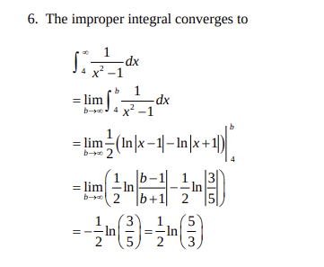

# 7.5 Numerical Methods for Definite Integrals

`deltax` = (right bound - left bound ) / intervals

Left: `deltax * f(x0) + f(xn-1)`

Right: `deltax * f(x1) + f(xn)`

#### Trapezoid Rule

- While the midpoint rule uses the midpoint between each sub-interval, the trapezoid just averages the left and right results
  - `TRAP(n) = (LEFT(n) + RIGHT(n)) / 2`

#### Over or Under Estimates Rules and Relationships

How to Use Rules:
- *f* negative AND integral is `a -> b` where `a` < `b`
  - reverse each of the below rules 
  - because values of sums will be negative
- right is always opposite of left
- midpoints is always opposite of trapezoid
- Left and Right will always be more of an over or under estimate than midpoint and trapezoid

Rules:
- *f* increasing
  - right = over
- *f* decreasing
  - right = under
- *f* concave down (looks like an `n` - `n` is in word "down")
  - trapezoial = under
- *f* concave up (looks up a `u`, `u` is in word "up")
  - trapezoidal = over

#### Signs of Functions

##### Negative Functions
- To get the area under the curve value, swap the lower and upper bound (turn negative to positive)
  - In this case, the overestimate/underestimate rule still applies
  - If bounds are not swapped `Integrate[f(x), {x, a, b}] where a < b`, then the left-hand rule becomes the over-estimate and right-hand rule becomes under-estaimte, because the result will always be a negative value

##### Mixed Functions
- If the function takes on both positive and negative values, then the Riemann sum is the sum of the areas of the rectangles that lie above the x-axis and the negative of the areas of the recatangles that lie blow the x-axis
  - I.e., the areas of the rectangles where *f* is positive minus the areas of the rectangles where *f* is negative

### Error

`Error = Actual Value - Approximate Value`

- The error in both the left and right rules decreases by afactor of about 5 as n increases by a factor of 5
  - 10 times work for every digit
- The error for the midpoint rule, in absolute value, seems to be about half the error of the trapezoid rule
- The error in trapezoid and midpoint decreases by a factor of about 25 as n increases by a factor of 5.
  - This squaring relationship holds for any factor
  - 10 times work for every 2 digits

#### Simpsons Rule

- As n increases by a factor of 5, the errors decrease by a factor of about 600, or 5^4
  - This behavior holds for any factor
- In Simpson's rule, each extra 4 digits of accuracy requires about 10 times the work

### Approximating by Lines and Parabolas 

***Alternate Appraoch to Numerical Integration***

These rules for numerical integration can be obtained by approximating `f(x)` on subintervals by a function:
 - The left and right rules use constant functions
 - The trapezoid and midpoint rules use linear functions
 - Simpson's rule use quadratic functions

# 7.6 Improper Integrals

- 1/ln(x) as x approaches 1 = infinity

- when the limit of integration is infinite
- when the integrand becomes infinite
  - the function is unbounded near some points in the interval

**find the indefinite integral using the FTC and plugging in b for infinity -> then apply limit as b approaches infinity**

**Example**:

1. integral 2 -> infinity of 1/x^2
2. compute indefinite integral: -1/x + C
3. plug-in b for upper bound and calculate definite integral using FTC
4. i.e., find definite integral of -1/x from 2 to b
5.  FTC: (-1/b) - (-1/2)
6. apply limit as b approaches upper bound (infinity)
7. limit b -> inifnity of (-1/b) - (-1/2)
8. -1/infinity = 0, so limity b -> infinity = -(-1/2) = 1/2
9. The integral is imrproper because the upper limity of integration is infinity
10. therefore the improper integral converges to 1/2

**Process**
1. if the integral is imrpoper at both or one endpoints, we at an arbitrary point
1. If limits are infinity > infinity, split at arbitrary value c - if either diverge, the original integral diverges as well. If both converge, add them to get the integral 
1. if the function is unbounded at a point ***between** the bounds, break into two integrals split at that point. If the limits of integration approaching the split point are finte, it converges -- add to get integral. Else, the integral diverges 
2. compute definite integral
2. examine limits as b approaches value
2. if the function is unbounded near some points in the interval, it is improper
2. if the integrand tends to infinity *inside* the interval of integration (rather than an endpoint), it is improper
2. if the limit does not exist (unbounded function), it diverges
2. if the limit of integration if inifinte, it diverges 
2. if the integral diverges (integral tends to infinity as x approaches upper limit), it is improper
2. else if the limit of integration is finite, it converges
2. if the integral converges, define Integral a->b f(x) = lim c > b- of Integral a->c f(x)

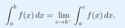

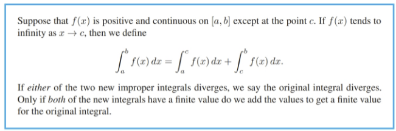

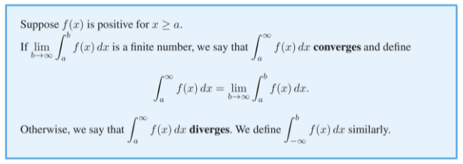

- Both functions approach 0 as x grows, so as b grows larger, smaller bits of area are being addded to the definite integral. The differrence  between the functinos is subtle: the values of the function 1/sqrt(x) *dont shrink fast enough* for the integral to have a finite value. Of the two functions, 1/x^2 drops to 0 much faster than 1/sqrt(x) and this feature keeps the area under 1/x^2 from growing beyond 1.

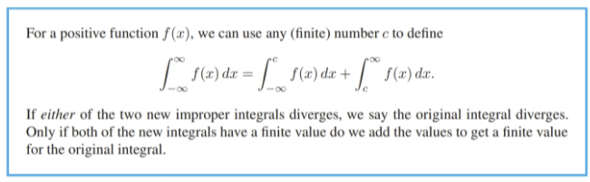

# 7.7 Comparison of Improper Integrals

- We first look at the behavior of the integrand as x -> infinite because the convergence or divergence of the integral is determined by what happens as x approaches inifinity

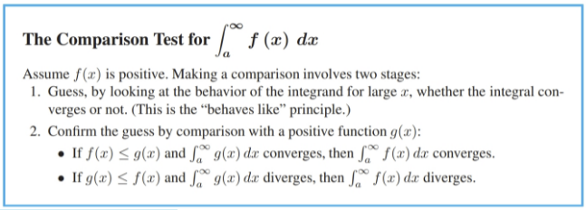

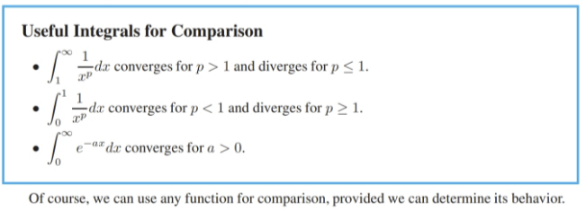

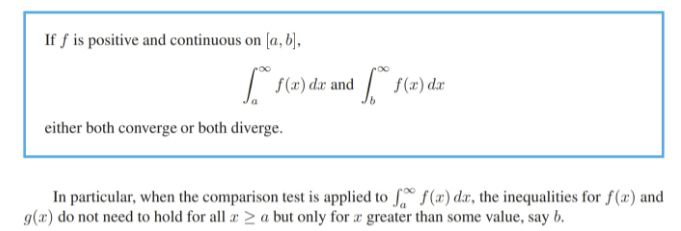

# 8.1 Areas and Volumes

## Process

1. Choose x-axis (eg height) by which the solid/curve can be split into small piecces  along
2. find formula for volume/area of slice (pythagorean or similar triangle)
3. get riemann sum of the slices which represetns the sum of all the slices
3. take the limit as the number of terms in the sum tends to infinity, giving a definite integral for the total volume
4. find indefinite integral between bounds defined by the x-axis (e.g., if the x-axis is height, from the starting height to the finishing height of the geometric object)
5. compute the integral for the given bounds

## Area

#### Isosceles Triangle

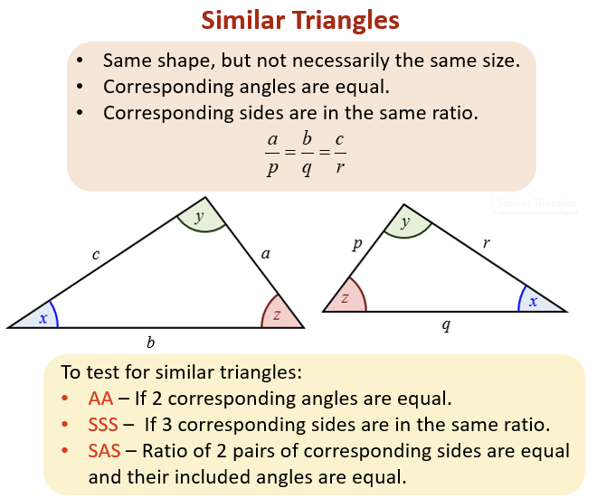

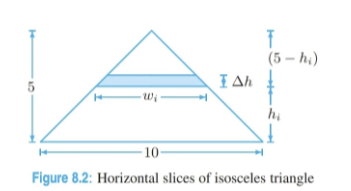

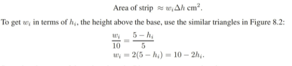

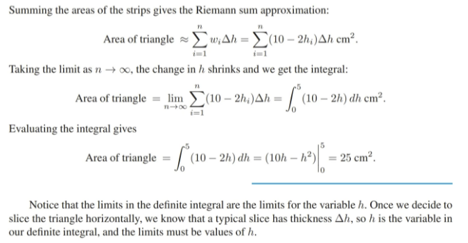

#### Circle

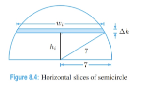

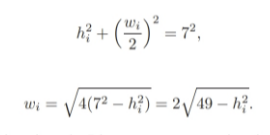

## Volume

#### Cone

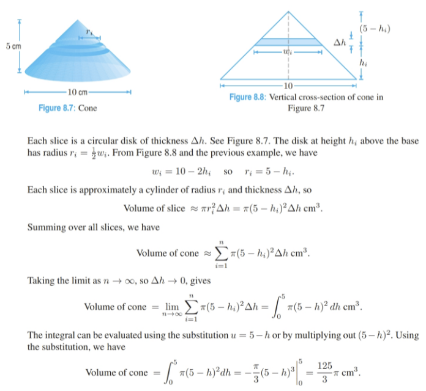

#### Sphere

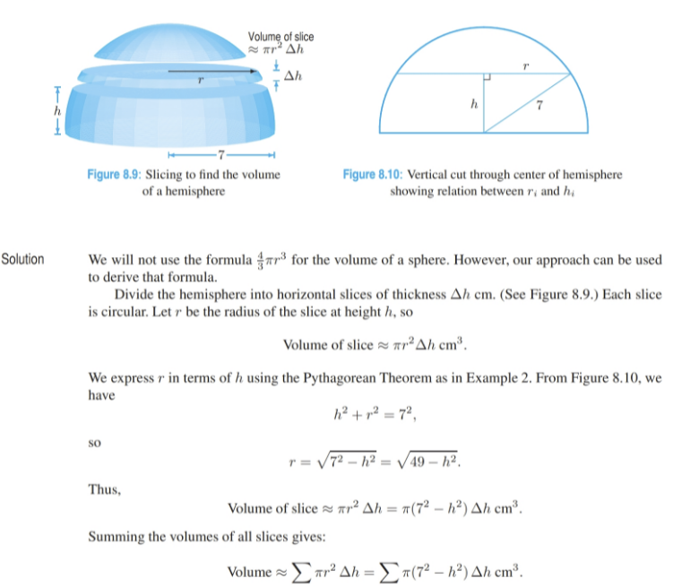

#### Pyramid

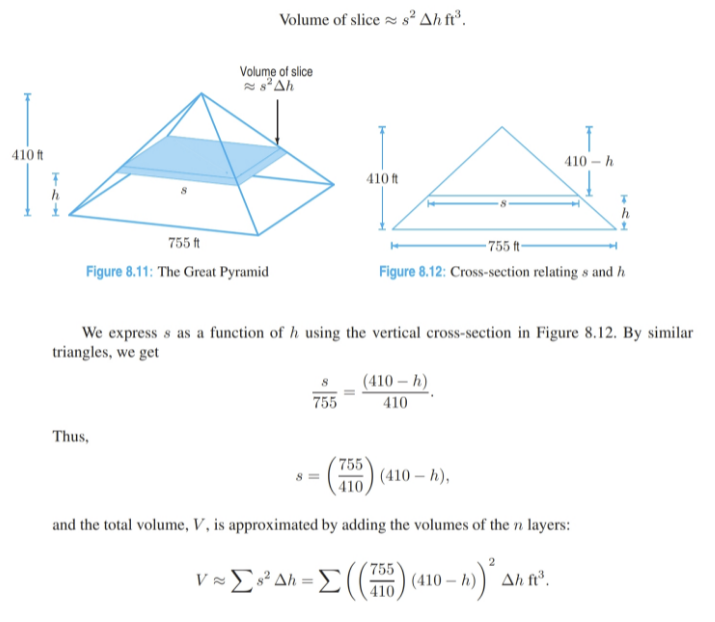

# 8.2 Applications to Geometry

## Volumes of Revolution

1. slice perpindicular to x-axis
2. create circular disks of thickness detla-x
3. the radius of the disk is the function
4. thus the volume of a slice = pi*y^2 * detla-x
5. as the thickness tends to zero -> compute definite integral across domain of the formula for a slice

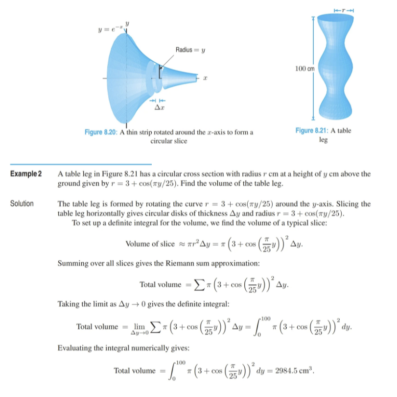

#### Bounded Intersection

1. find intersection to find upper bound
2. determine volumes of revolution for each function
3. volume of difference = volume of outer (function that bounds inner) - volume of inner 
4. computer indefinite integral from first intersection to second intersection of volume of difference (outer slice minus inner slice)

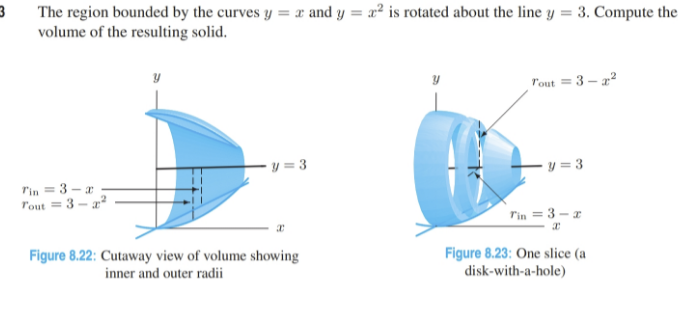

#### Known Cross-Section Base

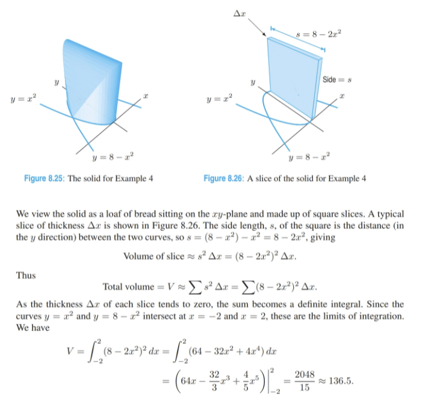

#### Arc Length

1. derivative of f(x) = change in y over change in x, thus change in y equals derviative of f(x) times change in x
2. take increasingly smaller triangles along the perimteter of the arc
3. determine formula for hypotenuse of triangle using sides delta-x and delta-y
4. determine riemann summ of permieter distances
5. compute indefinite intrgral across domain

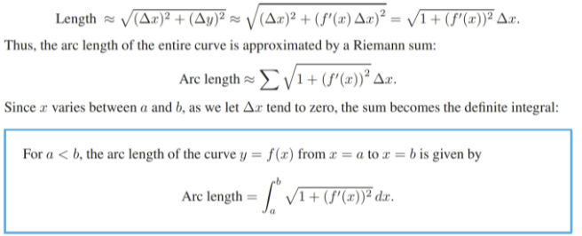

#### Parametric Arc Length

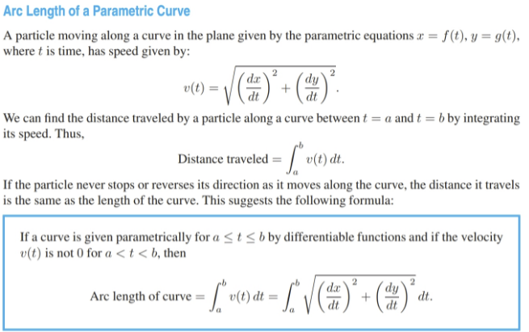

- the difference in x and the difference in y for each new sectino of the arc length represents two sides of a right triangle
- the hypotenuse of that trianlge represents the distance traveled / the permiter of the arc over that domain
- that value is also equivalent to the distance traveled given that e are finding the integral of velocity 
- the indefinite integral of the formula for the hypotneuse over the given domain represents the total arc length over that domain

# 8.4 Density and Mass

> To find total quantity from density, divide the region into small pieces in such a way that the density is approximately constant on each piece, and add the contributions of the pieces

- if density and volume are given, the total mass can be computed by finding the integral of dneisty times volume, etc.
- determine formula for slices over the domain for volume
- determine formula for slices of density over the domain
- determeine indefinite integral of their product

### Center of Mass

`moment of mass about pivote = mass * displacement from pivot`

- the seesaw balances if the total moment is zero
- thus, the center of mass is the point about which the total moment is zero

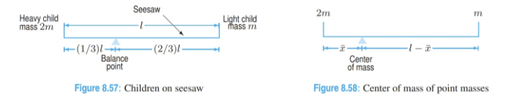

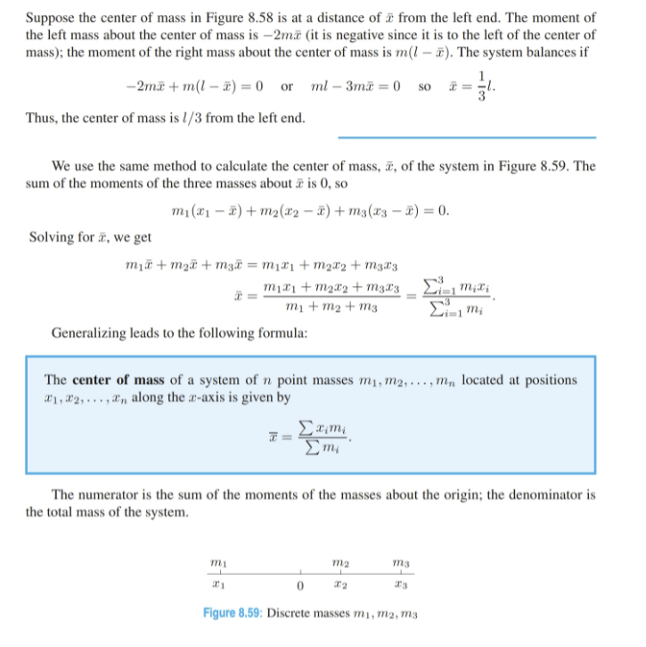

### Continuous Mass Density

[Finish Reading Here](https://online.vitalsource.com/reader/books/9781118748558/pageid/459)

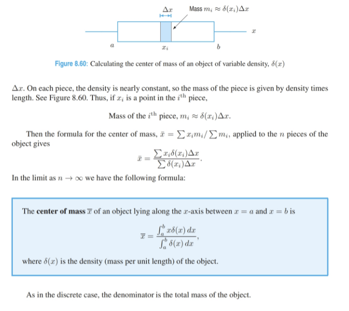

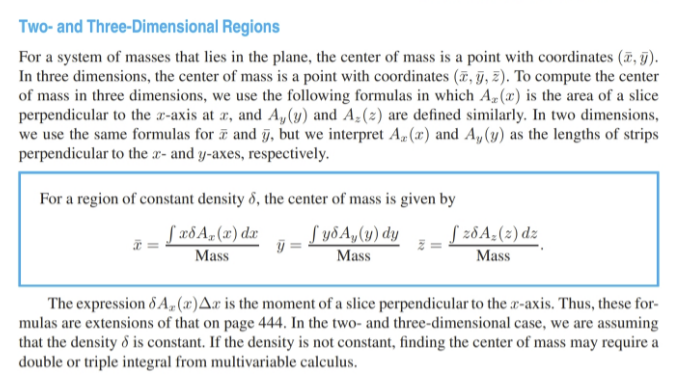

