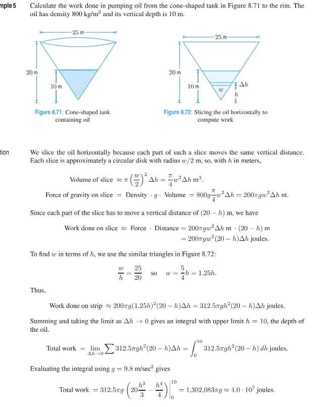
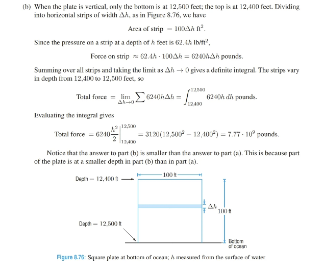
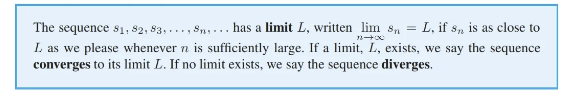
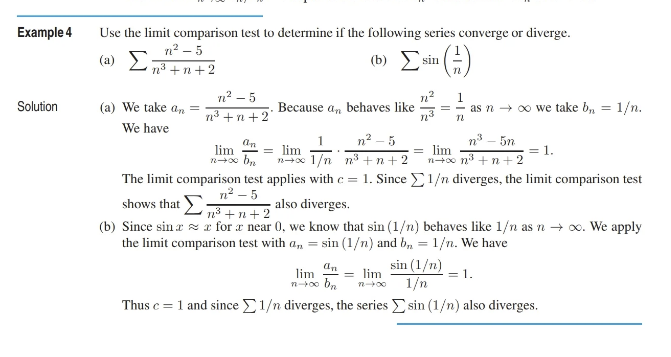

<!-- TOC -->

- [Exam 3 Study Guide](#exam-3-study-guide)
  - [Applications to Physics](#applications-to-physics)
    - [Formulas](#formulas)
    - [Force Due to Gravity](#force-due-to-gravity)
    - [Cone Example](#cone-example)
    - [Pyramid Example](#pyramid-example)
    - [Force and Pressure](#force-and-pressure)
      - [Titanic Example](#titanic-example)
- [Sequences](#sequences)
  - [Recursive Sequences](#recursive-sequences)
  - [Convergence of Sequences](#convergence-of-sequences)
  - [Convergence and Bounded Sequences](#convergence-and-bounded-sequences)
    - [Monotone Sequences](#monotone-sequences)
- [Geometric Series](#geometric-series)
  - [Closed Form Expression](#closed-form-expression)
    - [As a Series](#as-a-series)
    - [As a Series Multipled by Growth Factor](#as-a-series-multipled-by-growth-factor)
      - [Finding Stabilization](#finding-stabilization)
  - [The Geometric Series in General](#the-geometric-series-in-general)
    - [Sum of a Finite Geometric Series](#sum-of-a-finite-geometric-series)
    - [Sum of an Infinite Geometric Series](#sum-of-an-infinite-geometric-series)
- [Convergence of Series](#convergence-of-series)
  - [Partial Sums and Convergence of Series](#partial-sums-and-convergence-of-series)
    - [Reverse Engineering](#reverse-engineering)
  - [Convergence Properties of Series](#convergence-properties-of-series)
    - [Comparison of Series and Integrals](#comparison-of-series-and-integrals)
      - [The Integral Test](#the-integral-test)
- [Tests for Convergence](#tests-for-convergence)
  - [Using Behaves Like Property](#using-behaves-like-property)
  - [Limit Comparison Test](#limit-comparison-test)
  - [Series of Both Positive and Negative Terms](#series-of-both-positive-and-negative-terms)
  - [The Ratio Test](#the-ratio-test)
  - [Alternating Series](#alternating-series)
  - [Error Bounds and Absolute and Conditional Convergence](#error-bounds-and-absolute-and-conditional-convergence)
- [Power Series and Interval of Convergence](#power-series-and-interval-of-convergence)
  - [Intervals of Convergence](#intervals-of-convergence)

<!-- /TOC -->

# Exam 3 Study Guide

Sections Covered:
- 8.5 - Applications to Physics
- 9.1 - Sequences
- 9.2 - Geometric Series
- 9.3 - Convergence of Series
- 9.4 - Tests for Convergence
- 9.5 - Power Series and Interval of Convergence

## Applications to Physics

***8.5***

### Formulas

- `Work = Force * Distance`
  - Force must be parallel to the motion
  - One joule of work is done when a force of 1 newton moves an object through 1 meter
    - so 1 joule = 1 newton-meter
- `Work = Integral[F(x), {x, a, b}]`, where `F(x)` is a force as a function of distance `x`
- `g = 9.8 m/sec^2`
  - When given the weight of an object, we do not multiply by `g` to find graviational force as it has already been done
    - A pound is a unit of weight
    - A kg is a unit of mass
      - The unit of weight is a newtwon, where `1 newton = 1 kg * m/sec^2`
- `Pressure = Mass Density * g * Depth`
- `Force = Pressure * Area`
  - Pressure is the area density of force -- the amount of force per area
  - When the plate is horizontal, the pressure is the same at every point on the plate
  

### Force Due to Gravity

- Mass = downward gravitational force acting on a mass `m` is `mg` where `g` is the accelerate due to gravity
  - To lift the obbject, we need to exert a force equal to the graviational force but in the opposite direction

### Cone Example

### Pyramid Example

### Force and Pressure

- Get force exerted by a liquid on a surface
- Get force from pressure
- Pressure in a liquid is the force per unit area exerted by the liquid
  - At any point, pressure is exerted equally in all directions
  - Pressure increases with depth
- At a depth `h` meters, the pressure `p` exerted by the liquid (measured in newtons per square meter) is given by computing the total weight of the column of liquid `h` meters high with a base of 1 sqaure meter
  - Thje volume of such a soclumn of liquid is just `h` cubic meters
- If the liquid has a density `r` (mass per unit vouem), then its weight per unit volume is `rg`, where g is the acceleration due to gravity
- The weight of the column of liquid is `rgh`, so `pressure = mass density * g * Depth`

#### Titanic Example

------

# Sequences

***9.1***

## Recursive Sequences

- Sequences can be defined recursively, by giving an equation relating the nth term to the previous terms and as many of the first few terms are needed to get started

## Convergence of Sequences

- The limit of a sequence s_n as n -> infinity is defined the same way as the limit of a function f(x) as x -> infinity

## Convergence and Bounded Sequences

### Monotone Sequences

-----------

# Geometric Series

***9.2***

- Adding the terms of a sequence produces a *series*

## Closed Form Expression

### As a Series

### As a Series Multipled by Growth Factor

- Multiply both sides of series equation by the growth factor (.04 in this case)

- Now we have an equation for q10 and an equation for .04q10
- Subtract multiplied equation from original equation
  - .04q10 from q10
- All terms cancel out except first term in original and last term in multiplied

- Then factor and solve for q10

#### Finding Stabilization

- More precisely, as n -> infinity, the value for qn tells you the amount of drug in the body in the long run average

## The Geometric Series in General

- A geometric sreies is one in which each term is a constant multiple of the one before
- The first term is `a`
- The constant multiplier, or *common ratio* of successive terms, is `x`

### Sum of a Finite Geometric Series

1. Multiply qn by the common ratio
2. subtract the multiplied qn from the original qn
3. All terms cancel out except the first and last of each series respectively

### Sum of an Infinite Geometric Series

- Consider the sum of n terms
- Find the limit as n approaches infinity
- When `|x| < 1`, x^n approaches 0 as n approaches inifnity
  - Thus, the limit as n -> infinity of the sum is given:

- When `|x| > 1`, then x^n diverges (has no limit) 
  - Thus, the series diverges
  - If x > 1, The partial sums diverge to +infinity (if a > 0)
  - If x < -1, 
    - the terms become larger in magnitude
    - the partial sums oscillate as n -> infinite
    - the series diverges
  - If x = 1,
    - If a != 0, the series grows without bound and does not converge
  - If x = -1,
    - If a != 0, the partial sums oscillate between a and 0, and the series does not converge

---------

# Convergence of Series

***9.3***

## Partial Sums and Convergence of Series

- Let Sn = the partial sum of the first n terms

- If Sn has a limit as n -> infinity, then we define the sume of the series to be that limit
- If the limit does not exist, the series diverges

### Reverse Engineering

- Finding integral of Qn

## Convergence Properties of Series

*Note*

- To show that a series converges,
- show that the partial sums of the series tend to a limit
- The sequence of partial sums = a left-hand riemman sum (type of integral) of the series
  - That is, if a given term is Qn at index n, the integral of Qn with respect to n is the sum of the series and the sequence of the partial sum is the behavior of that sum with respect to n
    - If that sequnece (the integral with respect to n) does not equal 0, theorem 9.2 part 3 applies
    - If that sequence increases, it obiously diverges and grwos without bound -- even if slowly

### Comparison of Series and Integrals

1. Setup the integral of the partial sums
2. Solve by using b-substitution
3. Add the initial term to both sides 
4. Indicates the bound but not the limit
5. Allows us to infer whether converges or diverges

#### The Integral Test

-------

# Tests for Convergence

***9.4***

## Using Behaves Like Property

## Limit Comparison Test

## Series of Both Positive and Negative Terms

## The Ratio Test

## Alternating Series

## Error Bounds and Absolute and Conditional Convergence

---------

# Power Series and Interval of Convergence

## Intervals of Convergence

