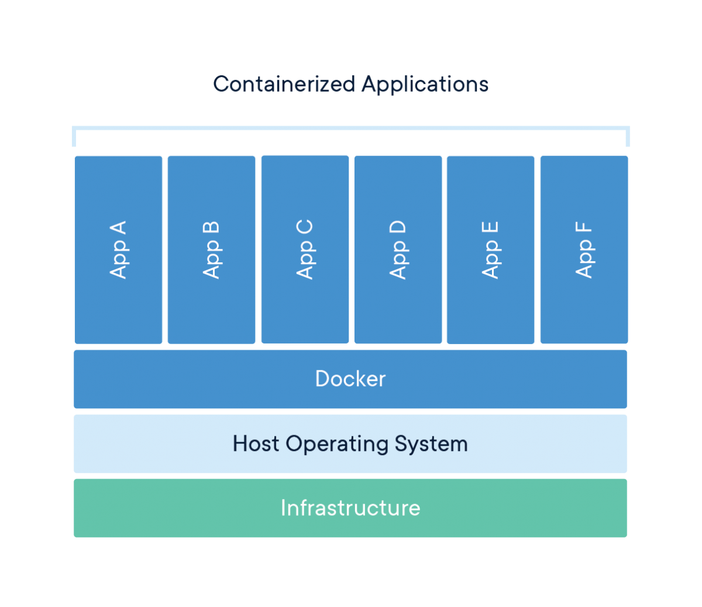
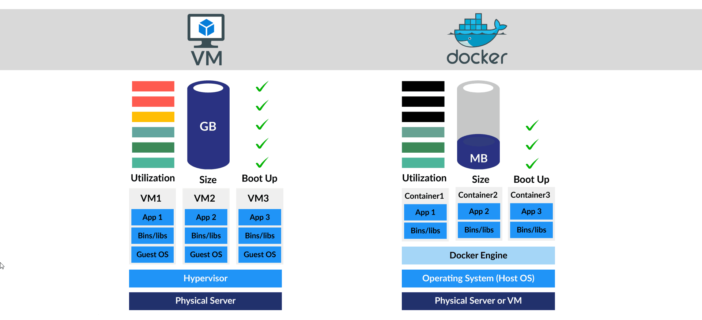
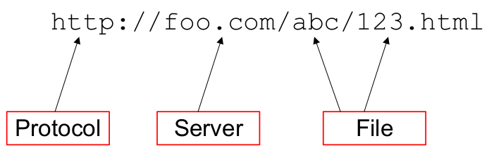
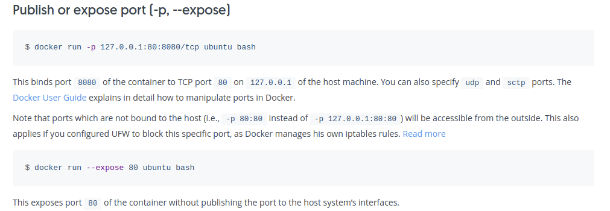
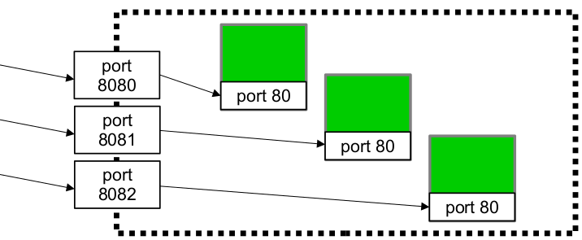
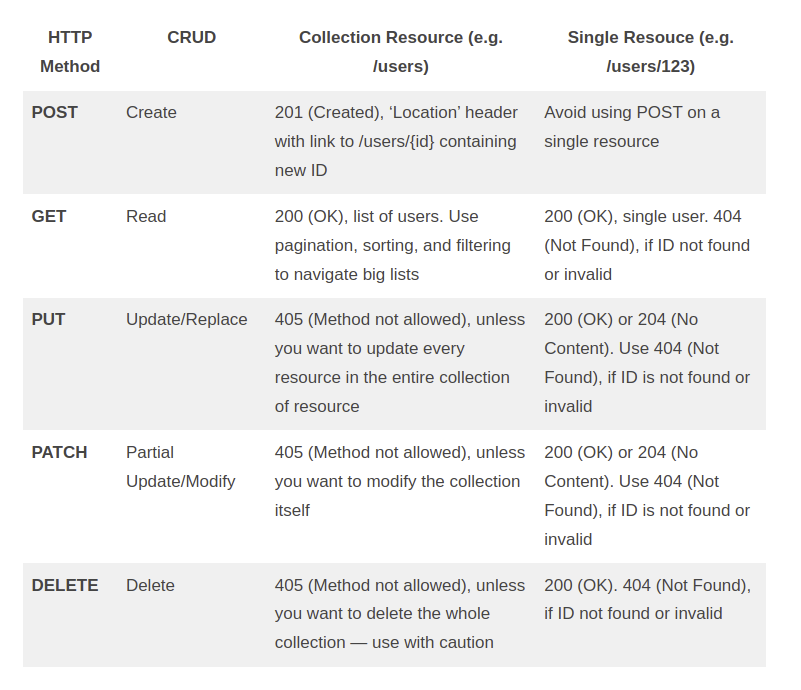

<!-- TOC -->

- [Docker](#docker)
  - [Containers](#containers)
    - [Alternatives to Containers](#alternatives-to-containers)
      - [Packages](#packages)
      - [Virtual Machines](#virtual-machines)
        - [VM Images](#vm-images)
        - [VM Advantages](#vm-advantages)
        - [VM Downsides](#vm-downsides)
        - [Container vs VM Difference](#container-vs-vm-difference)
    - [Benefits of Containers](#benefits-of-containers)
      - [Consistency](#consistency)
      - [Performance](#performance)
      - [Reduced Overhead](#reduced-overhead)
      - [Security](#security)
      - [Uses](#uses)
      - [Create Once Run Everywhere](#create-once-run-everywhere)
    - [Cloud Containers](#cloud-containers)
    - [Images](#images)
  - [Docker Commands](#docker-commands)
    - [Run](#run)
      - [All Options](#all-options)
      - [Psuedo tty](#psuedo-tty)
    - [ps](#ps)
    - [rm and rmi](#rm-and-rmi)
    - [images](#images)
    - [exec](#exec)
  - [Install Software in a Container](#install-software-in-a-container)
  - [Committing New Images](#committing-new-images)
    - [Image Properties](#image-properties)
  - [Docker cp](#docker-cp)
- [UNIX](#unix)
  - [More and Less](#more-and-less)
  - [Redirection and Piping](#redirection-and-piping)
  - [ssh](#ssh)
  - [scp](#scp)
  - [Shebang Line](#shebang-line)
    - [Examples](#examples)
  - [Permissions](#permissions)
    - [chmod](#chmod)
      - [Examples](#examples)
- [Network Tools and Sockets](#network-tools-and-sockets)
  - [HTML](#html)
    - [Link Destinations](#link-destinations)
  - [HTTP](#http)
    - [Headers](#headers)
      - [Connection](#connection)
      - [Keep Alive](#keep-alive)
      - [Proxy Authenticate](#proxy-authenticate)
      - [Proxy-Authorization](#proxy-authorization)
      - [Other Header Fields](#other-header-fields)
    - [Other User Agents](#other-user-agents)
      - [wget](#wget)
      - [curl](#curl)
      - [telnet](#telnet)
      - [netcat](#netcat)
      - [Python Requests Module](#python-requests-module)
        - [Response Attributes](#response-attributes)
  - [Ports](#ports)
  - [Sockets](#sockets)
    - [Socket API](#socket-api)
    - [Socket States in Client Server Model](#socket-states-in-client-server-model)
    - [UDP Sockets](#udp-sockets)
    - [Socket Programming with Python](#socket-programming-with-python)
      - [Create a Socket](#create-a-socket)
      - [Socket Object Methods](#socket-object-methods)
      - [Listening Sockets](#listening-sockets)
      - [Connected Sockets](#connected-sockets)
      - [Echo Server Example](#echo-server-example)
        - [Server](#server)
        - [Client](#client)
      - [Decoding Bytes to Unicode](#decoding-bytes-to-unicode)
      - [recv](#recv)
      - [sendall](#sendall)
      - [close](#close)
      - [Single Threaded Server Example](#single-threaded-server-example)
      - [Single-Threaded Client Example](#single-threaded-client-example)
- [Web Servers and Container Networking](#web-servers-and-container-networking)
  - [Web Servers](#web-servers)
  - [Port Forwarding](#port-forwarding)
  - [Network Address Translation](#network-address-translation)
    - [NAT for Containers](#nat-for-containers)
- [CGI](#cgi)
  - [Purpose of the CGI specification](#purpose-of-the-cgi-specification)
  - [Using CGI scripts](#using-cgi-scripts)
  - [Deployment](#deployment)
  - [Alternatives](#alternatives)
  - [Usage](#usage)
    - [Script Directory](#script-directory)
    - [Example Script](#example-script)
    - [Python CGI Module](#python-cgi-module)
  - [CGI Variables](#cgi-variables)
    - [POST Requests with CGI](#post-requests-with-cgi)
      - [Different POST Encoding](#different-post-encoding)
  - [Requests from CGI Process](#requests-from-cgi-process)
  - [Debugging CGI](#debugging-cgi)
- [JSON](#json)
  - [Python json Module](#python-json-module)
- [REST](#rest)
  - [REST APIs](#rest-apis)
    - [Data Structuring](#data-structuring)
    - [HTTP Methods and REST](#http-methods-and-rest)
      - [Common Error Reasons](#common-error-reasons)
      - [Redirect](#redirect)
  - [Path Infro Env Variable](#path-infro-env-variable)
  - [Status Codes](#status-codes)
- [Git](#git)
  - [Key Commands](#key-commands)
  - [GitHub](#github)
  - [Using Passwords](#using-passwords)
    - [curl](#curl)
    - [requests](#requests)
    - [Cookies and Sessions](#cookies-and-sessions)
    - [Password Security Measures](#password-security-measures)

<!-- /TOC -->


# Docker

- Docker is a tool for running containers
  - Standard unit of software that packages up code and all its dependencies so the application runs quickly and reliably from one computing environment to another.
- A Docker container image is a lightweight, standalone, executable package of software that includes everything needed to run an application
- Built on the leading open source container runtime, a graduated project of the Cloud Native Computing Foundation (CNCF). Containerd implements Kubernetes Container Runtime Interface (CRI) and is widely adopted across public clouds and enterprises
- BuildKit is an open source tool that takes the instructions from a Dockerfile and ‘builds” a Docker image. This process can take a long time so BuildKit provides several architectural enhancements that makes it much faster, more precise and portable.
- The most popular way to interface with Docker containers is the Docker CLI - a simple, yet powerful client that greatly simplifies how you manage container instances through a clear set of commands.

## Containers

- code, runtime, system tools, system libraries and settings.
- Container images become containers at runtime
  - In the case of Docker containers - images become containers when they run on Docker Engine.
- Private environment for running programs
- Complete filesystem
- Private networking
- _Almost_ like a virtual machine



### Alternatives to Containers

#### Packages

Downsides:

- Dependency conflicts
  - Differnet software requiring different versions of dependencies
- Ancient code from ancient dependencies
- Individual programs install one at a time
- Lots of steps to configure server

#### Virtual Machines

- Designed by running software on top of physical servers to emulate a particular hardware system.
- A hypervisor, or a virtual machine monitor, is software, firmware, or hardware that creates and runs VMs
  - What sits between the hardware and the virtual machine and is necessary to virtualize the server.
- Within each VM runs a unique guest OS
- VMs with different OS can run on the same physical server
- Each VM has its own binaries, libraries, and applications that it services, and the VM may be many gigabytes in size.
- One physical server hosts many virtual servers
- Reduces cost per server
- Still slow to configure
- Consumes resources when idle



##### VM Images

- Full hard drive image, including OS
- Run on VMs
- Still common as the **start** point for virtual computing
  - add packages (or containers) to build a system
- Downsides:
  - Massive size
  - Cannot send per-server config

##### VM Advantages

- Consolidate applications onto a single system
- Reduced footprint
- Faster server provisioning
- Improved disaster recovery (DR)
  - DR site hardware no longer had to mirror the primary data center.
- Greater utilization on larger, faster servers freed up subsequently unused servers to be repurposed for QA, development, or lab gear

##### VM Downsides

- Each VM includes a separate operating system image, which adds overhead in memory and storage footprint
- Severely limits the portability of applications between public clouds, private clouds, and traditional data centers.
- On the other hand, containers sit on top of a physical server and its host OS
  - Each container shares the host OS kernel and, usually, the binaries and libraries, too
  - Shared components are read-only.
  - Containers are thus exceptionally “light”—they are only megabytes in size and take just seconds to start, versus gigabytes and minutes for a VM.

##### Container vs VM Difference

- Containers are lighter weight and more portable than VMs
- The primary difference is that containers provide a way to virtualize an OS so that multiple workloads can run on a single OS instance
- With VMs, the hardware is being virtualized to run multiple OS instances.

### Benefits of Containers

#### Consistency

- Containerized software will always run the same, regardless of the infrastructure.
- Containers isolate software from its environment and ensure that it works uniformly despite differences for instance between development and staging.

#### Performance

- Complete disk image, including dependencies
- No OS; no virtual hardware
  - Containers share the machine’s OS system kernel and therefore do not require an OS per application, driving higher server efficiencies and reducing server and licensing costs
  - Therefore, consumes very little CPU
  - OS doesn't have to boot - fast startup
- Designed to run only one application
- Stipped to bare bones to make image small
  - All containers based off of **immutable images**
  - Often composed as "delta" of a standard image
    - Make it cheap to transfer over the network and/or store locally

#### Reduced Overhead

- Because they share a common operating system, only a single operating system needs care and feeding for bug fixes, patches, and so on.

#### Security

- Applications are safer in containers and Docker provides the strongest default isolation capabilities in the industry
- Private networking and NAT

#### Uses

- Enables dynamic scaling in cloud
  - Number of operating systems is function of demand/concurrency
  - When demand lowers, containers are destroyed
    - Servers therefore not over-allocated
- Enables standard libraries and version locking
- Enable efficient testing

#### Create Once Run Everywhere

- Immutable images
- Data in a given container is not saved when container stops
- All that persists is the starting image

### Cloud Containers

- Cloud services are often organized as many identical micro-servers
- They are all running the same code
  - config variables may vary, but only by a little
- When load grows, rapidly add more servers
- When load drops, kill old servers
- All critical data is stored on one or more centralized databases

### Images

- Start point for a container is stored as an immutable image
  - Containers are created by duplicating this image
- Images are immutable
- A container is an instance of an image

## Docker Commands

```
Usage:  docker [OPTIONS] COMMAND

A self-sufficient runtime for containers

Options:
      --config string      Location of client config files (default "/home/bymyself/.docker")
  -c, --context string     Name of the context to use to connect to the daemon (overrides DOCKER_HOST env
                           var and default context set with "docker context use")
  -D, --debug              Enable debug mode
  -H, --host list          Daemon socket(s) to connect to
  -l, --log-level string   Set the logging level ("debug"|"info"|"warn"|"error"|"fatal") (default "info")
      --tls                Use TLS; implied by --tlsverify
      --tlscacert string   Trust certs signed only by this CA (default "/home/bymyself/.docker/ca.pem")
      --tlscert string     Path to TLS certificate file (default "/home/bymyself/.docker/cert.pem")
      --tlskey string      Path to TLS key file (default "/home/bymyself/.docker/key.pem")
      --tlsverify          Use TLS and verify the remote
  -v, --version            Print version information and quit

Management Commands:
  app*        Docker App (Docker Inc., v0.9.1-beta3)
  builder     Manage builds
  buildx*     Build with BuildKit (Docker Inc., v0.6.1-docker)
  config      Manage Docker configs
  container   Manage containers
  context     Manage contexts
  image       Manage images
  manifest    Manage Docker image manifests and manifest lists
  network     Manage networks
  node        Manage Swarm nodes
  plugin      Manage plugins
  scan*       Docker Scan (Docker Inc., v0.8.0)
  secret      Manage Docker secrets
  service     Manage services
  stack       Manage Docker stacks
  swarm       Manage Swarm
  system      Manage Docker
  trust       Manage trust on Docker images
  volume      Manage volumes

Commands:
  attach      Attach local standard input, output, and error streams to a running container
  build       Build an image from a Dockerfile
  commit      Create a new image from a container's changes
  cp          Copy files/folders between a container and the local filesystem
  create      Create a new container
  diff        Inspect changes to files or directories on a container's filesystem
  events      Get real time events from the server
  exec        Run a command in a running container
  export      Export a container's filesystem as a tar archive
  history     Show the history of an image
  images      List images
  import      Import the contents from a tarball to create a filesystem image
  info        Display system-wide information
  inspect     Return low-level information on Docker objects
  kill        Kill one or more running containers
  load        Load an image from a tar archive or STDIN
  login       Log in to a Docker registry
  logout      Log out from a Docker registry
  logs        Fetch the logs of a container
  pause       Pause all processes within one or more containers
  port        List port mappings or a specific mapping for the container
  ps          List containers
  pull        Pull an image or a repository from a registry
  push        Push an image or a repository to a registry
  rename      Rename a container
  restart     Restart one or more containers
  rm          Remove one or more containers
  rmi         Remove one or more images
  run         Run a command in a new container
  save        Save one or more images to a tar archive (streamed to STDOUT by default)
  search      Search the Docker Hub for images
  start       Start one or more stopped containers
  stats       Display a live stream of container(s) resource usage statistics
  stop        Stop one or more running containers
  tag         Create a tag TARGET_IMAGE that refers to SOURCE_IMAGE
  top         Display the running processes of a container
  unpause     Unpause all processes within one or more containers
  update      Update configuration of one or more containers
  version     Show the Docker version information
  wait        Block until one or more containers stop, then print their exit codes
```

### Run

```bash
docker run -ti <image>
```

- `t` allocate a psuedo terminal
- `i` keep stdin open even if not attached
- `<image>` names can be local
  - If there is no local image by the name, auto-download one from Docker Hub

```bash
docker run --rm <image>
```

- Automatically remove the container after it exits
- When a container stops, its data is not thrown away immediately unless this option is added
  - Instead, the container is saved until you clean it up
    - It will not be visible in `docker ps`, unless you add the `-a` arg

#### All Options

```
Usage:  docker run [OPTIONS] IMAGE [COMMAND] [ARG...]

Run a command in a new container

Options:
      --add-host list                  Add a custom host-to-IP mapping (host:ip)
  -a, --attach list                    Attach to STDIN, STDOUT or STDERR
      --blkio-weight uint16            Block IO (relative weight), between 10 and 1000, or 0 to disable
                                       (default 0)
      --blkio-weight-device list       Block IO weight (relative device weight) (default [])
      --cap-add list                   Add Linux capabilities
      --cap-drop list                  Drop Linux capabilities
      --cgroup-parent string           Optional parent cgroup for the container
      --cgroupns string                Cgroup namespace to use (host|private)
                                       'host':    Run the container in the Docker host's cgroup namespace
                                       'private': Run the container in its own private cgroup namespace
                                       '':        Use the cgroup namespace as configured by the
                                                  default-cgroupns-mode option on the daemon (default)
      --cidfile string                 Write the container ID to the file
      --cpu-period int                 Limit CPU CFS (Completely Fair Scheduler) period
      --cpu-quota int                  Limit CPU CFS (Completely Fair Scheduler) quota
      --cpu-rt-period int              Limit CPU real-time period in microseconds
      --cpu-rt-runtime int             Limit CPU real-time runtime in microseconds
  -c, --cpu-shares int                 CPU shares (relative weight)
      --cpus decimal                   Number of CPUs
      --cpuset-cpus string             CPUs in which to allow execution (0-3, 0,1)
      --cpuset-mems string             MEMs in which to allow execution (0-3, 0,1)
  -d, --detach                         Run container in background and print container ID
      --detach-keys string             Override the key sequence for detaching a container
      --device list                    Add a host device to the container
      --device-cgroup-rule list        Add a rule to the cgroup allowed devices list
      --device-read-bps list           Limit read rate (bytes per second) from a device (default [])
      --device-read-iops list          Limit read rate (IO per second) from a device (default [])
      --device-write-bps list          Limit write rate (bytes per second) to a device (default [])
      --device-write-iops list         Limit write rate (IO per second) to a device (default [])
      --disable-content-trust          Skip image verification (default true)
      --dns list                       Set custom DNS servers
      --dns-option list                Set DNS options
      --dns-search list                Set custom DNS search domains
      --domainname string              Container NIS domain name
      --entrypoint string              Overwrite the default ENTRYPOINT of the image
  -e, --env list                       Set environment variables
      --env-file list                  Read in a file of environment variables
      --expose list                    Expose a port or a range of ports
      --gpus gpu-request               GPU devices to add to the container ('all' to pass all GPUs)
      --group-add list                 Add additional groups to join
      --health-cmd string              Command to run to check health
      --health-interval duration       Time between running the check (ms|s|m|h) (default 0s)
      --health-retries int             Consecutive failures needed to report unhealthy
      --health-start-period duration   Start period for the container to initialize before starting
                                       health-retries countdown (ms|s|m|h) (default 0s)
      --health-timeout duration        Maximum time to allow one check to run (ms|s|m|h) (default 0s)
      --help                           Print usage
  -h, --hostname string                Container host name
      --init                           Run an init inside the container that forwards signals and reaps
                                       processes
  -i, --interactive                    Keep STDIN open even if not attached
      --ip string                      IPv4 address (e.g., 172.30.100.104)
      --ip6 string                     IPv6 address (e.g., 2001:db8::33)
      --ipc string                     IPC mode to use
      --isolation string               Container isolation technology
      --kernel-memory bytes            Kernel memory limit
  -l, --label list                     Set meta data on a container
      --label-file list                Read in a line delimited file of labels
      --link list                      Add link to another container
      --link-local-ip list             Container IPv4/IPv6 link-local addresses
      --log-driver string              Logging driver for the container
      --log-opt list                   Log driver options
      --mac-address string             Container MAC address (e.g., 92:d0:c6:0a:29:33)
  -m, --memory bytes                   Memory limit
      --memory-reservation bytes       Memory soft limit
      --memory-swap bytes              Swap limit equal to memory plus swap: '-1' to enable unlimited swap
      --memory-swappiness int          Tune container memory swappiness (0 to 100) (default -1)
      --mount mount                    Attach a filesystem mount to the container
      --name string                    Assign a name to the container
      --network network                Connect a container to a network
      --network-alias list             Add network-scoped alias for the container
      --no-healthcheck                 Disable any container-specified HEALTHCHECK
      --oom-kill-disable               Disable OOM Killer
      --oom-score-adj int              Tune host's OOM preferences (-1000 to 1000)
      --pid string                     PID namespace to use
      --pids-limit int                 Tune container pids limit (set -1 for unlimited)
      --platform string                Set platform if server is multi-platform capable
      --privileged                     Give extended privileges to this container
  -p, --publish list                   Publish a container's port(s) to the host
  -P, --publish-all                    Publish all exposed ports to random ports
      --pull string                    Pull image before running ("always"|"missing"|"never") (default
                                       "missing")
      --read-only                      Mount the container's root filesystem as read only
      --restart string                 Restart policy to apply when a container exits (default "no")
      --rm                             Automatically remove the container when it exits
      --runtime string                 Runtime to use for this container
      --security-opt list              Security Options
      --shm-size bytes                 Size of /dev/shm
      --sig-proxy                      Proxy received signals to the process (default true)
      --stop-signal string             Signal to stop a container (default "SIGTERM")
      --stop-timeout int               Timeout (in seconds) to stop a container
      --storage-opt list               Storage driver options for the container
      --sysctl map                     Sysctl options (default map[])
      --tmpfs list                     Mount a tmpfs directory
  -t, --tty                            Allocate a pseudo-TTY
      --ulimit ulimit                  Ulimit options (default [])
  -u, --user string                    Username or UID (format: <name|uid>[:<group|gid>])
      --userns string                  User namespace to use
      --uts string                     UTS namespace to use
  -v, --volume list                    Bind mount a volume
      --volume-driver string           Optional volume driver for the container
      --volumes-from list              Mount volumes from the specified container(s)
  -w, --workdir string                 Working directory inside the container

```

#### Psuedo tty

With the first terminals, there was always a piece of hardware attached with associated device, be it display hardware or a serial port.

With xwindows, telnet and ssh, there came a need for software "Pseudo devices" to do the job of standing in for display hardware. They are "Pseudo Terminals" ... software that emulates Terminal hardware, handling input and output in the same way a physical device would so that the software connected is not aware there's not a real device attached.

In some operating systems, including Unix and Linux, a pseudoterminal, pseudotty, or PTY is a pair of pseudo-device endpoints (files) which establish asynchronous, bidirectional communication (IPC) channel (with two ports) between two or more processes.[1][2][3] The master provides means by which a terminal emulator process controls the slave. The slave, emulates a hardware text terminal device.[1] PTY are similar to bidirectional pipes.

The master files are typically used by networking applications (e.g. ssh) and slave files are used by terminal-oriented programs such as shells (e.g. bash) as a processes to read/write data back from/to master endpoint.[1] Common application of PTYs is in providing network login services.[3]

Devpts is a Linux Kernel virtual file system used to emulate PTYs connection.

Linux implementation is based on System V-style terminals (commonly referred as UNIX 98 pseudoterminals)[4] and provides POSIX and the Single Unix Specification API in the form of a posix_openpt() function since 1998.[5]

Unix tty command is typically used to get PTY file path connected to the current standard input.

### ps

```bash
docker ps
```

- List the current running containers

### rm and rmi

```bash
docker rm <id>
```

- Removes a stopped container
- `<id>` can be word name or ID or hash
  - Can be abbreviated as long as no ambiguity
    - E.g., `docker rm 8` will work if there is only one container whose id starts with an 8

```bash
docker rmi <id>
```

- Removes an image
- `<id>` can be the repository name or the numeric ID
- Cannot remove image that is currently in use

### images

```bash
docker images
```

- Lits the current images known to the local computer
- Thousands more are available on Docker Hub and other services

### exec

```bash
# Runs another command inside a **running** container
docker exec -ti <container> <cmd>

# Get another psuedo TTY
docker exec -ti 123 bash
```

## Install Software in a Container

- Use the distro's package manager
- Start by downloading the package metadata from the registry
  - `apt-get update`

## Committing New Images

```bash
docker commit <container> <name>
```

- Container can be running or stopped
- The name you create is local
- Can upload to Docker Hub
- Avoid time/network overhead involved with installing software on new containers

### Image Properties

```
Usage:  docker inspect [OPTIONS] NAME|ID [NAME|ID...]

Return low-level information on Docker objects

Options:
  -f, --format string   Format the output using the given Go template
  -s, --size            Display total file sizes if the type is container
      --type string     Return JSON for specified type

```

## Docker cp

```
Usage:  docker cp [OPTIONS] CONTAINER:SRC_PATH DEST_PATH|-
	docker cp [OPTIONS] SRC_PATH|- CONTAINER:DEST_PATH

Copy files/folders between a container and the local filesystem

Use '-' as the source to read a tar archive from stdin
and extract it to a directory destination in a container.
Use '-' as the destination to stream a tar archive of a
container source to stdout.

Options:
  -a, --archive       Archive mode (copy all uid/gid information)
  -L, --follow-link   Always follow symbol link in SRC_PATH

```

---

# UNIX

```bash
head -n [count] [file]

tail -f [count] [file]

# Follow a file as new lines are added
tail -f [file]

cut -?
cut --help
man cut
```

## More and Less

- Some very minimal systems only have `more`
  - because it's smaller and simpler
- Arrow key scrolling on `less`, `space` on `more`
- Less features
  - `/string<ENTER>` to search
    - `n` to find next
  - `g` to return to top
  - `Shift-G` bottom
- `more` doesn't allow you to go backwards

## Redirection and Piping

- Redirecting is piping but instead of piping stdout to the terminal stdin, it redirects it to a file
- `stdin` can be redirected
  - `cmd < <input_file>`
  - Both on same command: `cmd < in > out`

## ssh

```bash
ssh <username>@<host>

ssh [userid]@lectura.cs.arizona.edu
```

- Secure Shell (SSH) is a cryptographic network protocol for operating network services securely over an unsecured network
- Typical applications include remote command-line, login, and remote command execution, but any network service can be secured with SSH.
- SSH provides a secure channel over an unsecured network by using a client–server architecture, connecting an SSH client application with an SSH server.
- The protocol specification distinguishes between two major versions, referred to as SSH-1 and SSH-2.
- The standard TCP port for SSH is 22. SSH is generally used to access Unix-like operating systems, but it can also be used on Microsoft Windows.
- SSH was designed as a replacement for Telnet and for unsecured remote shell protocols
  - Those protocols send sensitive information, notably passwords, in plaintext, rendering them susceptible to interception and disclosure using packet analysis.- The encryption used by SSH is intended to provide confidentiality and integrity of data over an unsecured network, such as the Internet

```
usage: ssh [-46AaCfGgKkMNnqsTtVvXxYy] [-B bind_interface]
           [-b bind_address] [-c cipher_spec] [-D [bind_address:]port]
           [-E log_file] [-e escape_char] [-F configfile] [-I pkcs11]
           [-i identity_file] [-J [user@]host[:port]] [-L address]
           [-l login_name] [-m mac_spec] [-O ctl_cmd] [-o option] [-p port]
           [-Q query_option] [-R address] [-S ctl_path] [-W host:port]
           [-w local_tun[:remote_tun]] destination [command]
```

## scp

```
usage: scp [-346BCpqrTv] [-c cipher] [-F ssh_config] [-i identity_file]
            [-J destination] [-l limit] [-o ssh_option] [-P port]
            [-S program] source ... target
```

- Secure copy protocol (SCP) is a means of securely transferring computer files between a local host and a remote host or between two remote hosts
- Based on the Secure Shell (SSH) protocol.
- "SCP" commonly refers to both the Secure Copy Protocol and the program itself
- According to OpenSSH developers in April 2019, SCP is outdated, inflexible and not readily fixed; they recommend the use of more modern protocols like sftp and rsync for file transfer

## Shebang Line

- In UNIX, you can turn any text file into an executable command
- When a text file with a shebang is used as if it is an executable in a Unix-like operating system, the program loader mechanism parses the rest of the file's initial line as an interpreter directive.
- The loader executes the specified interpreter program, passing to it as an argument the path that was initially used when attempting to run the script, so that the program may use the file as input data.
  - For example, if a script is named with the path path/to/script, and it starts with the following line, #!/bin/sh, then the program loader is instructed to run the program /bin/sh, passing path/to/script as the first argument.
- Add shebang line and turn on executable permissions

```
#!interpreter [optional-arg]
```

### Examples

- `#!/bin/sh` – Execute the file using the Bourne shell, or a compatible shell, assumed to be in the /bin directory
- `#!/bin/bash` – Execute the file using the Bash shell
- `#!/usr/bin/pwsh` – Execute the file using PowerShell
- `#!/usr/bin/env python3` – Execute with a Python interpreter, using the env program search path to find it
- `#!/bin/false` – Do nothing, but return a non-zero exit status, indicating failure. Used to prevent stand-alone execution of a script file intended for execution in a specific context, such as by the . command from sh/bash, source from csh/tcsh, or as a .profile, .cshrc, or .login file.

## Permissions

- All UNIX files and dirs have 9 basic permissions
  - 3 bits for each of three users
    - Bits: read / write / execute
    - Users: owner / group / other
- Use `ls -al` to show the permissions on files
  - `-rw-r--r--`
    - owner: read write; group: read; other: read

### chmod

- Use to change permissions of a file or dir

```
Usage: chmod [OPTION]... MODE[,MODE]... FILE...
  or:  chmod [OPTION]... OCTAL-MODE FILE...
  or:  chmod [OPTION]... --reference=RFILE FILE...
Change the mode of each FILE to MODE.
With --reference, change the mode of each FILE to that of RFILE.

  -c, --changes          like verbose but report only when a change is made
  -f, --silent, --quiet  suppress most error messages
  -v, --verbose          output a diagnostic for every file processed
      --no-preserve-root  do not treat '/' specially (the default)
      --preserve-root    fail to operate recursively on '/'
      --reference=RFILE  use RFILE's mode instead of MODE values
  -R, --recursive        change files and directories recursively
      --help     display this help and exit
      --version  output version information and exit

Each MODE is of the form '[ugoa]*([-+=]([rwxXst]*|[ugo]))+|[-+=][0-7]+'.
```

#### Examples

```bash
# Give all users execute permission
chmod a+x someScript

# Let the owner write to some file
# but don't let the world even read it.
chmod o-rwx privateFile
chmod u+w privateFile
```

---

# Network Tools and Sockets

## HTML

- Web pages are writtein in HTML
- "Markup" means that HTML files are text files with special marks (tags)
  - Tags change how the enclosed text executes/displays
- "Hypertext" means that pages have links to other pages
- Tags have atttributes

### Link Destinations

- absolute URL (a full web address) in the href attribute.
- A local link (a link to a page within the same website) is specified with a relative URL (without the "https://www" part)
- Root relative `/` is relative to website root
- Relative is relative to html file location in website storage

## HTTP

- Hypertext Transfer Protocol (HTTP) is an application layer protocol in the Internet protocol suite model for distributed, collaborative, hypermedia information systems
- Foundation of data communication for the World Wide Web, where hypertext documents include hyperlinks to other resources
- Functions as a request–response protocol in the client–server computing model
  - A web browser, for example, may be the client and an application running on a computer hosting a website may be the server
  - The client submits an HTTP request message to the server. The server, which provides resources such as HTML files and other content, or performs other functions on behalf of the client, returns a response message to the client.
  - The response contains completion status information about the request and may also contain requested content in its message body
- Designed to permit intermediate network elements to improve or enable communications between clients and servers
- High-traffic websites often benefit from web cache servers that deliver content on behalf of upstream servers to improve response time
  - Web browsers cache previously accessed web resources and reuse them, when possible, to reduce network traffic
- HTTP proxy servers at private network boundaries can facilitate communication for clients without a globally routable address, by relaying messages with external servers.
- Designed within the framework of the Internet protocol suite. Its definition presumes an underlying and reliable transport layer protocol, and Transmission Control Protocol (TCP) is commonly used.
  - However, HTTP can be adapted to use unreliable protocols such as the User Datagram Protocol (UDP), for example in HTTPU and Simple Service Discovery Protocol (SSDP).
- HTTP resources are identified and located on the network by Uniform Resource Locators (URLs), using the Uniform Resource Identifiers (URI's) schemes http and https
  - URIs are encoded as hyperlinks in HTML documents, so as to form interlinked hypertext documents.
- HTTP/1.1 is a revision of the original HTTP (HTTP/1.0). In HTTP/1.0 a separate connection to the same server is made for every resource request
  - HTTP/1.1 can reuse a connection multiple times to download images, scripts, stylesheets, etc after the page has been delivered
  - HTTP/1.1 communications therefore experience less latency as the establishment of TCP connections presents considerable overhead



### Headers

[Docs for all headers](https://developer.mozilla.org/en-US/docs/Web/HTTP/Headers)

#### Connection

```
Connection: keep-alive
Connection: close
```

The Connection general header controls whether the network connection stays open after the current transaction finishes. If the value sent is keep-alive, the connection is persistent and not closed, allowing for subsequent requests to the same server to be done.

#### Keep Alive

The Keep-Alive general header allows the sender to hint about how the connection may be used to set a timeout and a maximum amount of requests.

```
Keep-Alive: <parameters>
```

Parameters:

- A comma-separated list of parameters, each consisting of an identifier and a value separated by the equal sign ('='). The following identifiers are possible:
  - timeout: An integer that is the time in seconds that the host will allow an idle connection to remain open before it is closed. A connection is idle if no data is sent or received by a host. A host may keep an idle connection open for longer than timeout seconds, but the host should attempt to retain a connection for at least timeout seconds.
  - max: An integer that is the maximum number of requests that can be sent on this connection before closing it. Unless 0, this value is ignored for non-pipelined connections as another request will be sent in the next response. An HTTP pipeline can use it to limit the pipelining.

#### Proxy Authenticate

```
Proxy-Authenticate: <type> realm=<realm>
```

The HTTP Proxy-Authenticate response header defines the authentication method that should be used to gain access to a resource behind a proxy server. It authenticates the request to the proxy server, allowing it to transmit the request furthe

#### Proxy-Authorization

```
Proxy-Authorization: <type> <credentials>
```

The HTTP Proxy-Authorization request header contains the credentials to authenticate a user agent to a proxy server, usually after the server has responded with a 407 Proxy Authentication Required status and the Proxy-Authenticate header.

#### Other Header Fields

- TE
  - The TE request header specifies the transfer encodings the user agent is willing to accept. (you could informally call it Accept-Transfer-Encoding, which would be more intuitive).
- Trailer
  - allows the sender to include additional fields at the end of chunked messages in order to supply metadata that might be dynamically generated while the message body is sent, such as a message integrity check, digital signature, or post-processing status.
- Transfer-Encoding
  - Specifies the form of encoding used to safely transfer the payload body to the user.
  - Transfer-Encoding is a hop-by-hop header, that is applied to a message between two nodes, not to a resource itself. Each segment of a multi-node connection can use different Transfer-Encoding values. If you want to compress data over the whole connection, use the end-to-end Content-Encoding header instead.
  - When present on a response to a HEAD request that has no body, it indicates the value that would have applied to the corresponding GET message.
- Upgrade
  - The HTTP 1.1 (only) Upgrade header can be used to upgrade an already established client/server connection to a different protocol (over the same transport protocol). For example, it can be used by a client to upgrade a connection from HTTP 1.1 to HTTP 2.0, or an HTTP or HTTPS connection into a WebSocket.

### Other User Agents

- A web browser is an example of a user agent (UA)
  - Other types of user agent include the indexing software used by search providers (web crawlers), voice browsers, mobile apps, and other software that accesses, consumes, or displays web content

#### wget

- Download a file onto the local machine
- `-r` for spidering a website

#### curl

```bash
# Cat a url
curl <url>

# Don't show a progress bar
curl -s <url>

# Lots of protocol details
curl -v <url>

# Throw away real page and only view protocl details
curl -vs <url> > /dev/null
```

#### telnet

- Ancient login tool
- Like `ssh` but without encryption
- Since it's so simple, it can be abused as a raw socket simulator

```
NAME
     telnet — user interface to the TELNET protocol

DESCRIPTION
     The telnet command is used for interactive communication with another host using the TELNET protocol. It
     begins in command mode, where it prints a telnet prompt ("telnet> "). If telnet is invoked with a host
     argument, it performs an open command implicitly; see the description below.

     Options:

     -4      Force IPv4 address resolution.

     -6      Force IPv6 address resolution.

     -8      Request 8-bit operation. This causes an attempt to negotiate the TELNET BINARY option for both
             input and output. By default telnet is not 8-bit clean.

     -E      Disables the escape character functionality; that is, sets the escape character to ``no charac‐
             ter''.

     -L      Specifies an 8-bit data path on output.  This causes the TELNET BINARY option to be negotiated on
             just output.

     -a      Attempt automatic login.  Currently, this sends the user name via the USER variable of the
             NEW-ENVIRON option if supported by the remote system. The username is retrieved via getlogin(3).

     -b address
             Use bind(2) on the local socket to bind it to a specific local address.

     -d      Sets the initial value of the debug toggle to TRUE.

     -r      Emulate rlogin(1).  In this mode, the default escape character is a tilde. Also, the interpreta‐
             tion of the escape character is changed: an escape character followed by a dot causes telnet to
             disconnect from the remote host. A ^Z instead of a dot suspends telnet, and a ^] (the default
             telnet escape character) generates a normal telnet prompt. These codes are accepted only at the
             beginning of a line.

     -S tos  Sets the IP type-of-service (TOS) option for the telnet connection to the value tos.

     -e escapechar
             Sets the escape character to escapechar. If no character is supplied, no escape character will be
             used.  Entering the escape character while connected causes telnet to drop to command mode.

     -l user
             Specify user as the user to log in as on the remote system. This is accomplished by sending the
             specified name as the USER environment variable, so it requires that the remote system support
             the TELNET NEW-ENVIRON option. This option implies the -a option, and may also be used with the
             open command.

     -n tracefile
             Opens tracefile for recording trace information.  See the set tracefile command below.

     host    Specifies a host to contact over the network.

     port    Specifies a port number or service name to contact. If not specified, the telnet port (23) is
             used.

     Protocol:

     Once a connection has been opened, telnet will attempt to enable the TELNET LINEMODE option.  If this
     fails, then telnet will revert to one of two input modes: either “character at a time” or “old line by
     line” depending on what the remote system supports.

     When LINEMODE is enabled, character processing is done on the local system, under the control of the re‐
     mote system.  When input editing or character echoing is to be disabled, the remote system will relay
     that information.  The remote system will also relay changes to any special characters that happen on the
     remote system, so that they can take effect on the local system.

     In “character at a time” mode, most text typed is immediately sent to the remote host for processing.

     In “old line by line” mode, all text is echoed locally, and (normally) only completed lines are sent to
     the remote host.  The “local echo character” (initially “^E”) may be used to turn off and on the local
     echo (this would mostly be used to enter passwords without the password being echoed).

     If the LINEMODE option is enabled, or if the localchars toggle is TRUE (the default for “old line by
     line“; see below), the user's quit, intr, and flush characters are trapped locally, and sent as TELNET
     protocol sequences to the remote side.  If LINEMODE has ever been enabled, then the user's susp and eof
     are also sent as TELNET protocol sequences, and quit is sent as a TELNET ABORT instead of BREAK There are
     options (see toggle autoflush and toggle autosynch below) which cause this action to flush subsequent
     output to the terminal (until the remote host acknowledges the TELNET sequence) and flush previous termi‐
     nal input (in the case of quit and intr).

     Commands:

     The following telnet commands are available. Unique prefixes are understood as abbreviations.

     auth argument ...
                The auth command controls the TELNET AUTHENTICATE protocol option.  If telnet was compiled
                without authentication, the auth command will not be supported.  Valid arguments are as fol‐
                lows:

                disable type  Disable the specified type of authentication.  To obtain a list of available
                              types, use the auth disable ? command.

                enable type   Enable the specified type of authentication.  To obtain a list of available
                              types, use the auth enable ? command.

                status        List the current status of the various types of authentication.

                Note that the current version of telnet does not support authentication.

     close      Close the connection to the remote host, if any, and return to command mode.

     display argument ...
                Display all, or some, of the set and toggle values (see below).

     encrypt argument ...
                The encrypt command controls the TELNET ENCRYPT protocol option. If telnet was compiled with‐
                out encryption, the encrypt command will not be supported.

                Valid arguments are as follows:

                disable type [input|output]
                              Disable the specified type of encryption.  If you do not specify input or out‐
                              put, encryption of both is disabled.  To obtain a list of available types, use
                              ``encrypt disable ?''.

                enable type [input|output]
                              Enable the specified type of encryption.  If you do not specify input or output,
                              encryption of both is enabled.  To obtain a list of available types, use ``en‐
                              crypt enable ?''.

                input         This is the same as ``encrypt start input''.

                -input        This is the same as ``encrypt stop input''.

                output        This is the same as ``encrypt start output''.

                -output       This is the same as ``encrypt stop output''.

                start [input|output]
                              Attempt to begin encrypting.  If you do not specify input or output, encryption
                              of both input and output is started.

                status        Display the current status of the encryption module.

                stop [input|output]
                              Stop encrypting.  If you do not specify input or output, encryption of both is
                              stopped.

                type type     Sets the default type of encryption to be used with later ``encrypt start'' or
                              ``encrypt stop'' commands.

                Note that the current version of telnet does not support encryption.
```

#### netcat

```
NAME
     nc — arbitrary TCP and UDP connections and listens

SYNOPSIS
     nc [-46bCDdFhklNnrStUuvZz] [-I length] [-i interval] [-M ttl] [-m minttl] [-O length] [-P proxy_username]
        [-p source_port] [-q seconds] [-s source] [-T keyword] [-V rtable] [-W recvlimit] [-w timeout]
        [-X proxy_protocol] [-x proxy_address[:port]] [destination] [port]

DESCRIPTION
     The nc (or netcat) utility is used for just about anything under the sun involving TCP, UDP, or
     UNIX-domain sockets.  It can open TCP connections, send UDP packets, listen on arbitrary TCP and UDP
     ports, do port scanning, and deal with both IPv4 and IPv6.  Unlike telnet(1), nc scripts nicely, and sep‐
     arates error messages onto standard error instead of sending them to standard output, as telnet(1) does
     with some.

     Common uses include:

           •   simple TCP proxies
           •   shell-script based HTTP clients and servers
           •   network daemon testing
           •   a SOCKS or HTTP ProxyCommand for ssh(1)
           •   and much, much more
```

#### Python Requests Module

- Useful in CGI
- Useful for automation

```bash
pip3 install requests
```

```python
import requests
r = requests.get(URL)
# r = status of request
```

##### Response Attributes

- `r.status_code`
- `r.text`
  - Decoded to string
  - Good for HTML and text files
- `r.content`
  - The raw bytes (of body) as sent over the network
  - Good for images
- `r.json`
  - Must be JSON data
  - Serialized to python dict
- `r.headers`
- `r.ok`
- `r.is_redirect`
- `r.reason`
- `r.url`
- `r.request`
- `r.history`

## Ports

- Most network protocols have a default port
  - HTTP = 80; SSH = 22; HTTPS = 443; SMTP = 25; MySQL = 3306
- A URL can point at any port number

## Sockets

- A network socket is a software structure within a network node of a computer network that serves as an endpoint for sending and receiving data across the network
- The structure and properties of a socket are defined by an application programming interface (API) for the networking architecture.
- Sockets are created only during the lifetime of a process of an application running in the node.
- Because of the standardization of the TCP/IP protocols in the development of the Internet, the term network socket is most commonly used in the context of the Internet protocol suite, and is therefore often also referred to as Internet socket.
  - In this context, a socket is externally identified to other hosts by its socket address, which is the triad of transport protocol, IP address, and port number.
- The term socket is also used for the software endpoint of node-internal inter-process communication (IPC), which often uses the same API as a network socket.

### Socket API

- A protocol stack, usually provided by the operating system (rather than as a separate library, for instance), is a set of services that allow processes to communicate over a network using the protocols that the stack implements.
  - The operating system forwards the payload of incoming IP packets to the corresponding application by extracting the socket address information from the IP and transport protocol headers and stripping the headers from the application data.
- The API that programs use to communicate with the protocol stack, using network sockets, is called a socket API.
  - Development of application programs that utilize this API is called socket programming or network programming.
- Internet socket APIs are usually based on the Berkeley sockets standard
  - Wherein, sockets are a form of file descriptor, due to the Unix philosophy that "everything is a file", and the analogies between sockets and files.
  - Both have functions to read, write, open, and close.
    - In practice the differences strain the analogy, and different interfaces (send and receive) are used on a socket.
    - In inter-process communication, each end generally has its own socket.
- In the standard Internet protocols TCP and UDP, a socket address is the combination of an IP address and a port number
- Sockets need not have a source address, for example, for only sending data, but if a program binds a socket to a source address, the socket can be used to receive data sent to that address. Based on this address, Internet sockets deliver incoming data packets to the appropriate application process.

### Socket States in Client Server Model

- Computer processes that provide application services are referred to as servers
  - create sockets on startup that are in the listening state
    - These sockets are waiting for initiatives from client programs.
- A TCP server may serve several clients concurrently by creating a unique dedicated socket for each client connection in a new child process or processing thread for each client
  - These are in the established state when a socket-to-socket virtual connection or virtual circuit (VC), also known as a TCP session, is established with the remote socket, providing a duplex byte stream.
- A server may create several concurrently established TCP sockets with the same local port number and local IP address, each mapped to its own server-child process, serving its own client process
  - They are treated as different sockets by the operating system since the remote socket address (the client IP address or port number) is different; i.e. since they have different socket pair tuples.

### UDP Sockets

- UDP sockets do not have a established state, because the protocol is connectionless.
- A UDP server process handles incoming datagrams from all remote clients sequentially through the same socket.
- Not identified by the remote address, but only by the local address, although each message has an associated remote address that can be retrieved from each datagram with the networking API

### Socket Programming with Python

> [Python socket module docs](https://docs.python.org/3/library/socket.html)

- The Python interface is a straightforward transliteration of the Unix system call and library interface for sockets to Python’s object-oriented style
  - The `socket()` function returns a socket object whose methods implement the various socket system calls
    - Parameter types are somewhat higher-level than in the C interface
    - as with `read()` and `write()` operations on Python files, buffer allocation on receive operations is automatic, and buffer length is implicit on send operations
- **Class Notes**
  - listening
    - represent open server ports
    - never can send/receive data
    - call `accept()`
      - Blocks until a connection comes in
      - Returns a new connected socket
      - Loop back, call `accept()` again to wait for next
  - connected
    - Created 2 ways
      - client side: `connect()`
      - server side: `accept()` from a listening socket
    - Once created, both types work the same
- Connected sockets (server or client) can
  - send data
  - recv data
- Always have to consider the possibility that data might move slowly. What happens if you have to wait a while?
  - `recv()` will block until some data arrives, but may
    not fill the buffer you provide
  - `send()` may not be able to send all of the data; I
    recommend you use sendall() to solve this

#### Create a Socket

```python
socket.socket(family=AF_INET, type=SOCK_STREAM, proto=0, fileno=None)
```

- Create a new socket using the given address family, socket type and protocol number.
- The address family should be AF_INET (the default), AF_INET6, AF_UNIX, AF_CAN, AF_PACKET, or AF_RDS.
- The socket type should be SOCK*STREAM (the default), SOCK_DGRAM, SOCK_RAW or perhaps one of the other SOCK* constants.
- The protocol number is usually zero and may be omitted or in the case where the address family is AF_CAN the protocol should be one of CAN_RAW, CAN_BCM, CAN_ISOTP or CAN_J1939.

```python
socket.create_connection(address[, timeout[, source_address]])
```

- Connect to a TCP service listening on the internet address (a 2-tuple (host, port)), and return the socket object
  - Higher-level function than socket.connect(): if host is a non-numeric hostname, it will try to resolve it for both AF_INET and AF_INET6, and then try to connect to all possible addresses in turn until a connection succeeds. This makes it easy to write clients that are compatible to both IPv4 and IPv6.

```python
socket.create_server(address, *, family=AF_INET, backlog=None, reuse_port=False, dualstack_ipv6=False)
```

- Convenience function which creates a TCP socket bound to address (a 2-tuple (host, port)) and return the socket object.

#### Socket Object Methods

```python
socket.accept()
```

- Accept a connection
- The socket must be bound to an address and listening for connections
- The return value is a pair (conn, address)
  - conn is a new socket object usable to send and receive data on the connection
  - address is the address bound to the socket on the other end of the connection.

```python
socket.bind(address)
```

- Bind the socket to address
- Must not already be bound. (The format of address depends on the address family — see above.)

```python
socket.close()
```

- Mark the socket closed
- Sockets are automatically closed when they are garbage-collected, but it is recommended to close() them explicitly, or to use a with statement around them.

```python
socket.connect_ex(address)
```

- Like connect(address), but return an error indicator instead of raising an exception for errors returned by the C-level connect() call
  - (other problems, such as “host not found,” can still raise exceptions)
- The error indicator is 0 if the operation succeeded, otherwise the value of the errno variable.
- This is useful to support, for example, asynchronous connects.

```python
socket.detach()
```

- Put the socket object into closed state without actually closing the underlying file descriptor
- The file descriptor is returned, and can be reused for other purposes.

```python
socket.dup()
```

- Duplicate the socket.

```python
socket.listen([backlog])¶
```

- Enable a server to accept connections
- If backlog is specified, it must be at least 0 (if it is lower, it is set to 0)
  - it specifies the number of unaccepted connections that the system will allow before refusing new connections
  - If not specified, a default reasonable value is chosen.

```python
socket.recv(bufsize[, flags])
```

- Receive data from the socket
- The return value is a bytes object representing the data received
- The maximum amount of data to be received at once is specified by bufsize
  - For best match with hardware and network realities, the value of bufsize should be a relatively small power of 2, for example, 4096.

<details>
  <summary>UNIX recv manual</summary>

- The recv(), recvfrom(), and recvmsg() calls are used to receive messages from a socket.
- All three calls return the length of the message on successful completion.
  - If a message is too long to fit in the supplied buffer, excess bytes ma be discarded depending on the type of socket the message is received from.
  - If no messages are available at the socket, the receive calls wait for a message to arrive, unless the socket is nonblocking (see fcntl(2))
    - in which case the value -1 is returned and the external variable errno is set to EAGAIN or EWOULDBLOCK
- The receive calls normally return any data available, up to the requested amount, rather than waiting for receipt of the full amount requested.
- An application can use select(2), poll(2), or epoll(7) to determine when more data arrives on a socket.
- The flags argument: The flags argument is formed by ORing one or more of the following values:

  - MSG_CMSG_CLOEXEC (recvmsg() only; since Linux 2.6.23)
    - Set the close-on-exec flag for the file descriptor received via a UNIX domain file descriptor using the SCM_RIGHTS operation (described in unix(7)). This flag is useful for the same reasons as the O_CLOEXEC flag of open(2).
  - MSG_DONTWAIT (since Linux 2.2)
    - Enables nonblocking operation
  - MSG_ERRQUEUE
    - This flag specifies that queued errors should be received from the socket error queue. The error is passed in an ancillary message with a type dependent on the protocol (for IPv4IP_RECVERR). The user should supply a buffer of sufficient size. See cmsg(3) and ip(7) for more information. The payload of the original packet that caused the error is passed as normal data via msg_iovec. The original destination address of the datagram that caused the error is supplied via msg_name.
  - MSG_OOB
    - This flag requests receipt of out-of-band data that would not be received in the normal data stream. Some protocols place expedited data at the head of the normal data queue, and thus this flag cannot be used with such protocols.
  - MSG_PEEK
    - This flag causes the receive operation to return data from the beginning of the receive queue without removing that data from the queue. Thus, a subsequent receive call will return the same data.
  - MSG_WAITALL
    - This flag requests that the operation block until the full request is satisfied
    - However, the call may still return less data than requested if a signal is caught, an error or disconnect occurs, or the next data to be received is of a different type than that returned.

- recvfrom()
  - places the received message into the buffer buf. The caller must specify the size of the buffer in len.
- recv()
  - The recv() call is normally used only on a connected socket (see connect(2)). It is equivalent to the call: recvfrom(fd, buf, len, flags, NULL, 0);
- recvmsg()
  - Uses a msghdr structure to minimize the number of directly supplied arguments.

</details>

```python
socket.recvfrom(bufsize[, flags])
```

- Receive data from the socket
- The return value is a pair (bytes, address) where bytes is a bytes object representing the data received and address is the address of the socket sending the data

```python
socket.recvmsg(bufsize[, ancbufsize[, flags]])
```

- Receive normal data (up to bufsize bytes) and ancillary data from the socket.
- The ancbufsize argument sets the size in bytes of the internal buffer used to receive the ancillary data; it defaults to 0, meaning that no ancillary data will be received
  - Appropriate buffer sizes for ancillary data can be calculated using CMSG_SPACE() or CMSG_LEN(), and items which do not fit into the buffer might be truncated or discarded. The flags argument defaults to 0 and has the same meaning as for recv().
- The return value is a 4-tuple: (data, ancdata, msg_flags, address)
  - The data item is a bytes object holding the non-ancillary data received
  - The ancdata item is a list of zero or more tuples (cmsg_level, cmsg_type, cmsg_data) representing the ancillary data (control messages) received: cmsg_level and cmsg_type are integers specifying the protocol level and protocol-specific type respectively, and cmsg_data is a bytes object holding the associated data
  - The msg_flags item is the bitwise OR of various flags indicating conditions on the received message; see your system documentation for details. If the receiving socket is unconnected, address is the address of the sending socket, if available; otherwise, its value is unspecified.
- Some systems do not indicate the truncated length of ancillary data items which have been only partially received. If an item appears to extend beyond the end of the buffer, recvmsg() will issue a RuntimeWarning, and will return the part of it which is inside the buffer provided it has not been truncated before the start of its associated data.

```python
socket.recvmsg_into(buffers[, ancbufsize[, flags]])
```

- Receive normal data and ancillary data from the socket, behaving as recvmsg() would, but scatter the non-ancillary data into a series of buffers instead of returning a new bytes object.
- The buffers argument must be an iterable of objects that export writable buffers (e.g. bytearray objects); these will be filled with successive chunks of the non-ancillary data until it has all been written or there are no more buffers.
- The operating system may set a limit (sysconf() value SC_IOV_MAX) on the number of buffers that can be used. The ancbufsize and flags arguments have the same meaning as for recvmsg().
- The return value is a 4-tuple: (nbytes, ancdata, msg_flags, address), where nbytes is the total number of bytes of non-ancillary data written into the buffers, and ancdata, msg_flags and address are the same as for recvmsg().

Example:

```python
>>>
>>> import socket
>>> s1, s2 = socket.socketpair()
>>> b1 = bytearray(b'----')
>>> b2 = bytearray(b'0123456789')
>>> b3 = bytearray(b'--------------')
>>> s1.send(b'Mary had a little lamb')
22
>>> s2.recvmsg_into([b1, memoryview(b2)[2:9], b3])
(22, [], 0, None)
>>> [b1, b2, b3]
[bytearray(b'Mary'), bytearray(b'01 had a 9'), bytearray(b'little lamb---')]
```

```python
socket.recv_into(buffer[, nbytes[, flags]])
```

- Receive up to nbytes bytes from the socket, storing the data into a buffer rather than creating a new bytestring.

```python
socket.send(bytes[, flags])
```

- Send data to the socket
- The socket must be connected to a remote socket
- The optional flags argument has the same meaning as for recv() above
- Returns the number of bytes sent
- Applications are responsible for checking that all data has been sent
  - if only some of the data was transmitted, the application needs to attempt delivery of the remaining data
- For further information on this topic, consult the Socket Programming HOWTO.

```python
socket.sendall(bytes[, flags])
```

- Unlike send(), this method continues to send data from bytes until either all data has been sent or an error occurs
- None is returned on success
- On error, an exception is raised, and there is no way to determine how much data, if any, was successfully sent.

```python
socket.sendto(bytes, address)
socket.sendto(bytes, flags, address)
```

- Send data to the socket
- The socket should not be connected to a remote socket, since the destination socket is specified by address.

```python
socket.sendmsg(buffers[, ancdata[, flags[, address]]])
```

- Send normal and ancillary data to the socket, gathering the non-ancillary data from a series of buffers and concatenating it into a single message.
- The buffers argument specifies the non-ancillary data as an iterable of bytes-like objects (e.g. bytes objects)

```python
socket.setblocking(flag)
```

- Set blocking or non-blocking mode of the socket
  - if flag is false, the socket is set to non-blocking
  - else to blocking mode.
- This method is a shorthand for certain settimeout() calls:
  - sock.setblocking(True) is equivalent to sock.settimeout(None)
  - sock.setblocking(False) is equivalent to sock.settimeout(0.0)

```python
socket.settimeout(value)
```

- Set a timeout on blocking socket operations
- The value argument can be a nonnegative floating point number expressing seconds, or None.
  - If a non-zero value is given, subsequent socket operations will raise a timeout exception if the timeout period value has elapsed before the operation has completed.
  - If zero is given, the socket is put in non-blocking mode. If None is given, the socket is put in blocking mode.

```python
socket.shutdown(how)
```

- Shut down one or both halves of the connection

```python
socket.share(process_id)
```

- Duplicate a socket and prepare it for sharing with a target process
- The target process must be provided with process_id.
- The resulting bytes object can then be passed to the target process using some form of interprocess communication and the socket can be recreated there using fromshare()
- Once this method has been called, it is safe to close the socket since the operating system has already duplicated it for the target process.

#### Listening Sockets

- Represent open server ports
- Never can send/receive data
- Call `accept()`
  - Blocks until a connection comes in
  - Returns a new connected socket
  - Loop back, call `accept()` again to wait for next

#### Connected Sockets

- Created 2 ways
  - Client side: call `connect()`
  - Server Side: `accept()`

#### Echo Server Example

##### Server

```python
import socket

HOST = ''                 # Symbolic name meaning all available interfaces
PORT = 50007              # Arbitrary non-privileged port
with socket.socket(socket.AF_INET, socket.SOCK_STREAM) as s:
    s.bind((HOST, PORT))
    s.listen(1)
    conn, addr = s.accept()
    with conn:
        print('Connected by', addr)
        while True:
            data = conn.recv(1024)
            if not data: break
            conn.sendall(data)
```

##### Client

```python
import socket

HOST = 'daring.cwi.nl'    # The remote host
PORT = 50007              # The same port as used by the server
with socket.socket(socket.AF_INET, socket.SOCK_STREAM) as s:
    s.connect((HOST, PORT))
    s.sendall(b'Hello, world')
    data = s.recv(1024)
print('Received', repr(data))
```

#### Decoding Bytes to Unicode

- `encode()` to convert `str` to `bytes`
- `decode()` to convert `bytes` to `str`

#### `recv()`

Use recv() to read data from a connected
socket.
– The parameter is the max length that you are
willing to read. You might read less.
– Returns empty string only if the socket has been
closed on the other end.
– If you’re reading string data (not a binary file), make
sure to decode
data = sock.recv(1024).decode()

#### `sendall()`

●
Use sendall() to send data down a
connected socket.
– The parameter is the payload.
– Make sure to encode, if your payload is a Python3
str
msg = “Hello world”
sock.sendall(msg.encode())
●
Avoid send() until you are more experienced;
74
it can sometimes send only part of the data.

#### `close()`

●
Make sure to close() every socket when
you’re done with it!
–
Especially on the server, you are going to be
creating lots of sockets, it’s possible to run
out.

#### Single Threaded Server Example

```python
from socket import *
server_sock = socket()

# 0.0.0.0 means "listen on all network interfaces"
server_addr = (“0.0.0.0”, PORT)
server_sock.bind(server_addr)
server_sock.listen(5)
while True:

    # Block until the next incoming connection arrives.
    # When it arrives, it will create a connected socket and return it
    (conn_sock,conn_addr) = \
        server_sock.accept()

    # Helper function takes a connected socket and does whatever your server does and then eventually diconnects
    do_work(conn_sock)
```

#### Single-Threaded Client Example

```python
from socket import *

sock = socket*()

addr = (SERVER_NAME, PORT)
sock.connect(addr)
do_client(sock)
```

---

# Web Servers and Container Networking

## Web Servers

- Software that acts as the server for the HTTP protocol
- Apache, inginx, IIS

```bash
apt-get install apache2
server apache2 start
```

- Generally, you use a directory on your server to represent the website
  - `/var/www/html` for apache
- When a client attempts access `foo/baz.html` the server prepends `/var/www/html`
- Web servers will serve any file they find

## Port Forwarding

- Allows programs outside of containers to access servers inside containers
- `p` option on `docker run` = `--publish`
  - Publish a container's port(s) to the host
- `docker run -p <address>:<external port>:<internal port>`
  - `docker run -p localhost:8080:80 <image>`
- 127.0.0.1 = lookback address = localhost
  - Used in a client, it means "attach to server on this computer"
  - Used in `bind()` in a server, it means "only allow connections from this computer"
- 0.0.0.0 or no address argument = any computer can use the port if they know your IP
- Expose the default port and give the outside world access to your container's server: `docker run -p 80:80 <image>`
- If only one port given as arg, it references the internal port and the external port is randomly assigned



- Use `docker ps` to check which ports are open on running containers
- It is **not possible** to forward the same external port to all internal servers
  - Must use different external port numbers to map to multiple servers
  - Or, set up a load balancer that spreads requests across the multiple servers
    - Normally, load balancers spread across multiple physical machines



## Network Address Translation

- Every computer on the Internet has an IP address
  - It is 4 integers, each 0..255. (32 bits)
- Network address translation (NAT) is a method of mapping an IP address space into another by modifying network address information in the IP header of packets while they are in transit across a traffic routing device
- The technique was originally used to avoid the need to assign a new address to every host when a network was moved, or when the upstream Internet service provider was replaced, but could not route the networks address space.
- It has become a popular and essential tool in conserving global address space in the face of IPv4 address exhaustion
- One Internet-routable IP address of a NAT gateway can be used for an entire private network
- As network address translation modifies the IP address information in packets, NAT implementations may vary in their specific behavior in various addressing cases and their effect on network traffic
- The specifics of NAT behavior are not commonly documented by vendors of equipment containing NAT implementations
- Your default gateway is the computer responsible for connecting you to the wider Internet.
  - On a WiFi network, the default gateway is typically the WiFi router itself
- When a packet is sent from the private network to the wider Internet, the gateway rewrites the packet to look as if the gateway sent the packet
- When a reply comes back, the gateway rewrites the reply automatically
- It is therefore impossible for machines outside the private netwrok to send data inside it (except replies)
  - Unless you have configured some port forwarding

### NAT for Containers

- Docker is the default gateway for containers
- Docker does NAT
  - Can be changed, but it's default

---

# CGI

- Common Gateway Interface (CGI) is an interface specification that enables web servers to execute an external program, typically to process user requests
- Such programs are often written in a scripting language and are commonly referred to as CGI scripts, but they may include compiled programs
- A typical use case occurs when a Web user submits a Web form on a web page that uses CGI
  - The form's data is sent to the Web server within an HTTP request with a URL denoting a CGI script
  - The Web server then launches the CGI script in a new computer process, passing the form data to it
  - The output of the CGI script, usually in the form of HTML, is returned by the script to the Web server, and the server relays it back to the browser as its response to the browser's request
- Developed in the early 1990s, CGI was the earliest common method available that allowed a Web page to be interactive
  - Although still in use, CGI is relatively inefficient compared to newer technologies and has largely been replaced by them

## Purpose of the CGI specification

- Each Web server runs HTTP server software, which responds to requests from web browsers
- Generally, the HTTP server has a directory (folder), which is designated as a document collection – files that can be sent to Web browsers connected to this server
- For pages constructed on the fly, the server software may defer requests to separate programs and relay the results to the requesting client
  - In the early days of the Web, such programs were usually small and written in a scripting language; hence, they were known as scripts.
  - Such programs usually require some additional information to be specified with the request
- HTTP provides ways for browsers to pass such information to the Web server, e.g. as part of the URL
  - The server software must then pass this information through to the script somehow.
  - Conversely, upon returning, the script must provide all the information required by HTTP for a response to the request:
    - the HTTP status of the request
    - the document content (if available)
    - the document type (e.g. HTML, PDF, or plain text)
    - et cetera.
- Initially, different server software would use different ways to exchange this information with scripts
  - As a result, it wasn't possible to write scripts that would work unmodified for different server software, even though the information being exchanged was the same
  - Therefore, it was decided to specify a way for exchanging this information: CGI (the Common Gateway Interface), as it defines a common way for server software to interface with scripts)
- Webpages generating programs invoked by server software that operate according to the CGI specification are known as CGI scripts.
- This specification was quickly adopted and is still supported by all well-known server software, such as Apache, IIS, and (with an extension) node.js-based servers.
- An early use of CGI scripts was to process forms
  - In the beginning of HTML, HTML forms typically had an "action" attribute and a button designated as the "submit" button.
  - When the submit button is pushed the URI specified in the "action" attribute would be sent to the server with the data from the form sent as a query string
  - If the "action" specifies a CGI script then the CGI script would be executed and it then produces an HTML page.

## Using CGI scripts

- A Web server allows its owner to configure which URLs shall be handled by which CGI scripts.
  - This is usually done by marking a new directory within the document collection as containing CGI scripts
    - its name is often cgi-bin
      - For example, `/usr/local/apache/htdocs/cgi-bin` could be designated as a CGI directory on the Web server
- When a Web browser requests a URL that points to a file within the CGI directory (e.g., http://example.com/cgi-bin/printenv.pl/with/additional/path?and=a&query=string), then, instead of simply sending that file (/usr/local/apache/htdocs/cgi-bin/printenv.pl) to the Web browser, the HTTP server runs the specified script and passes the output of the script to the Web browser
  - That is, anything that the script sends to standard output is passed to the Web client instead of being shown on-screen in a terminal window.
- As remarked above, the CGI specification defines how additional information passed with the request is passed to the script
  - For instance, if a slash and additional directory name(s) are appended to the URL immediately after the name of the script (in this example, /with/additional/path), then that path is stored in the PATH_INFO environment variable before the script is called.
  - If parameters are sent to the script via an HTTP GET request (a question mark appended to the URL, followed by param=value pairs; in the example, ?and=a&query=string), then those parameters are stored in the QUERY_STRING environment variable before the script is called
  - If parameters are sent to the script via an HTTP POST request, they are passed to the script's standard input
  - The script can then read these environment variables or data from standard input and adapt to the Web browser's request

## Deployment

- A Web server that supports CGI can be configured to interpret a URL that it serves as a reference to a CGI script
  - A common convention is to have a cgi-bin/ directory at the base of the directory tree and treat all executable files within this directory (and no other, for security) as CGI scripts
  - Another popular convention is to use filename extensions
    - For instance, if CGI scripts are consistently given the extension .cgi, the Web server can be configured to interpret all such files as CGI scripts. While convenient, and required by many prepackaged scripts, it opens the server to attack if a remote user can upload executable code with the proper extension.
- In the case of HTTP PUT or POSTs, the user-submitted data are provided to the program via the standard input.
  - The Web server creates a subset of the environment variables passed to it and adds details pertinent to the HTTP environment.

## Alternatives

- For each incoming HTTP request, a Web server creates a new CGI process for handling it and destroys the CGI process after the HTTP request has been handled
  - Creating and destroying a process can consume much more CPU and memory than the actual work of generating the output of the process, especially when the CGI program still needs to be interpreted by a virtual machine.
  - For a high number of HTTP requests, the resulting workload can quickly overwhelm the Web server.
- The overhead involved in CGI process creation and destruction can be reduced by the following techniques:
  - CGI programs precompiled to machine code, e.g. precompiled from C or C++ programs, rather than CGI programs interpreted by a virtual machine, e.g. Perl, PHP or Python programs.
  - Web server extensions such as Apache modules (e.g. mod_perl, mod_php, mod_python), NSAPI plugins, and ISAPI plugins which allow long-running application processes handling more than one request and hosted within the Web server.
  - Web 2.0 allows to transfer data from the client to the server without using HTML forms and without the user noticing
  - FastCGI, SCGI, and AJP which allow long-running application processes handling more than one request hosted externally to the Web server. Each application process listens on a socket; the Web server handles an HTTP request and sends it via another protocol (FastCGI, SCGI or AJP) to the socket only for dynamic content, while static content are usually handled directly by the Web server. This approach needs less application processes so consumes less memory than the Web server extension approach. And unlike converting an application program to a Web server extension, FastCGI, SCGI, and AJP application programs remain independent of the Web server.
  - Jakarta EE runs Jakarta Servlet applications in a Web container to serve dynamic content and optionally static content which replaces the overhead of creating and destroying processes with the much lower overhead of creating and destroying threads. It also exposes the programmer to the library that comes with Java SE on which the version of Jakarta EE in use is based.
- The optimal configuration for any Web application depends on application-specific details, amount of traffic, and complexity of the transaction; these trade-offs need to be analyzed to determine the best implementation for a given task and time budget. Web frameworks offer an alternative to using CGI scripts to interact with user agents.

## Usage

```bash
cd /etc/apache/mods-enabled
ln -s ../mods-available/cgi.load .
service apache2 restart
```

- When a web client attempts to access a file in `/cgi-bin`, the srever automatically executes the file
- Need shebang line to indicate the interpreter to use
- Need execute permissions
- Output from the script becomes the repsonse to the user
  - Response headers
  - blank line
  - the file itself

### Script Directory

- Ubuntu: `/usr/lib/cgi-bin`
- Other Distros: `/var/www/cgi-bin`

### Example Script

```python
#! /usr/bin/python3
print("Status: 200 OK")
print("Content-Type: text/plain")
print()
print("Hello world")
```

### Python CGI Module

```python
import cgi
form = cgi.FieldStorage()
if “asdf” in form:
  asdf = form[“asdf”].value
else:
  asdf = None
```

---

## CGI Variables

- In HTML Forms
  - The `name` attribute of HTML `input` elements corresponds to the variable key
- In URL (GET only)
  - `<a href=“/cgi-bin/foo.py?asdf=123”>link</a>`
- With `curl`
  - `curl http://example.org/cgi-bin/foo.py?x=10`
- With `requests` module
  - `r = requests.get(url, params={"first": "value", "second": "othervalue"})`

### POST Requests with CGI

- POST is technically for creating new things
  - GET is technically supposed to be read-only operations
  - In practice, POST is often used for any CGI operation that changes something
- Web browsers warn if a user asks to reload a POST page
  - But not on GET, so don't change anything on GET
- Variables don't show up in the URL bar
  - They are encoded in the **_body_** of the HTTP request rather than the URL
- In the Python CGI module, the `FieldStorage()` instance can access POST or GET variables
  - You can check which method:
    - `import os; print(os.environ["REQUEST_METHOD"])`
  - Reject incorrect methods using the status code: `405 Method Not Allowed`
    - And an Allow header: `Allow: GET`
- POST with `curl`
  - `curl -X POST -d "first=variable" http://example.org/cgi-bin/foo.py`
    ` With Requests module
  - `r = requests.post(url, params=vars)`
    - `params=[string]` to send raw data
    - `json=data` to auto-convert Python dictionaries or arrays into JSON-formatted text

#### Different POST Encoding

- Form-encoded POST bodies
  - first=variable&last=other
  - very common, matches how the web browser acts
- JSON Data
  - Do not use `cgi.FieldStorage()` instance
  - Instead, read from stdin
    - `import sys; data = sys.stdin.read()`
- Other

## Requests from CGI Process

- You can make requests from a CGI script (e.g., with Python request module)
  - Pass on a request to an underlying service
  - Look up information
  - Allocate, destroy, or configure a system
- Long-running operations should not be done in a CGI script
  - Instead, schedule something to happen asynchronously
- Any operations you perform should include timeoutes
  - `requests.get("http://abc.org", timeout=1)`

## Debugging CGI

- `/var/log/httpd/error_log`
- CGI TraceBack library
  - `import cgitb; cgitb.enable()`
  - Exposes a lot about CGI scripts -- never use in production

---

# JSON

- Informal, practical, human-readable
- Can't explicitly encode complex relationships
- Objects inside arrays, arrays inside objects, etc.
- Arbitrary depth
- Integers, floats, strings, true, false, null
- Indentation optional
- Transfer objects between computers
- Usually used for structured data
  - One object of a certain class
  - An array of same
  - Sometimes more complex
- Rarely encodes complex data
  - Trees, lists, graphs

## Python json Module

```python
import json

# Convert python data to JSON
json_data = json.dumps(dict)

# Convert JSON to python
objs = json.loads(input_text)
```

- `indent=int` argument to `dumps()` for pretty-printing

---

# REST

- REpresentational State Transfer
- JSON objects = DB records
- Send/recv over HTTP
- URLS = object IDs

## REST APIs

- https://restfulapi.net/http-methods/
- REST APIs enable you to develop any kind of web application having all possible CRUD (create, retrieve, update, delete) operations.
- REST guidelines suggest using a specific HTTP method on a particular type of call made to the server (though technically it is possible to violate this guideline, yet it is highly discouraged).
- A REST API is relative to some root directory e.g. `/cgi-bin/myBlog`
- The URL tells us what we are looking to read or write
  - E.g., `GET /cgi-bin/myBlog/posts/` accesses the collection named `posts`
  - `GET /cgi-bin/myBlod/posts/6` acceses the object of ID `6` in the collection named `posts`
  - `GET /cgi-bin/myBlog/posts/6/replies` accesses sub collection of object

### Data Structuring

- A collection is represented by an array in JSON
- Each object in a collection is represented by a dictionary in JSON
  - Typically, all of the objects will have the same fields
  - Usually, each object in a collection has a unique identifier
    - Can be auto-assigned integer, a user ID, or something else
- Sometimes, links inside objects are useful
  - They allow us to help the user find their way through the data

### HTTP Methods and REST



4 Common HTTP Methods for REST:

- GET - read the state of the system (read only)
- POST - create a new reocrd
  - Must be to a collection, not a specific record
  - Data sent as HTTP body
    - JSON-encoded
  - Defines several fields
  - Doesn't include any sub-collections or derived data such as hyperlinks
  - On Success: database is updated and user receives redirect status
- PUT - modify an existing record
  - Must be to a specific record, not a collection
  - Changes sent as HTTP body
    - JSON encoded
  - Lists only fields that neeed to change
  - Typically cannot change ID field
  - Cannot change derived data like hyperlinks
  - On Success: database is updated and user receives redirect status
  - Reason for Failutre: not valid ID, tries to change immutable fields, unrecognized field names
- DELETE - destroy a record
  - Must be to a specific record, not a collection
  - No HTTP body expected
  - On Success: Database is updated, user receives redirect status
  - Reasons for Failutre: deleting a collection not a record, not a valid record

#### Common Error Reasons

- Invalid URL (404)
- Invalid ID (404)
- Required POST/PUT body doesn't exist or isn't JSON (400)
- User not authorized (403 or 404)

#### Redirect

- When you make a change to the system, do **not** return `200 OK`
  - Instead, return `303 Redirect` to a GET which reads the recent change
- When a user reloads a POST page, the operation is re-reun
  - Can create a 2nd copy of what was POST-ed
  - Web browsers warn
- Solution: return `300 redirect` from POST and not `200`
  - Requires web browsers to do another page load, but with GET (and maybe a different address)
- Follow this rule for all POST, PUT, and DELETE operations

Example:

**Client sends**:

POST /cgi-bin/pets/people

**Server responds**:

Status: 303 Redirect
Location: http://example.org/cgi-bin/pets/people/123

**Client sends**:

GET /cgi-bin/pets/people/123

**Server responds**:

Status: 200 OK
Content-Type: “application/json”

- 303 redirect must be pairsed with a location header, which tells the browser where to go next
  - Do not produce a body
  - Since the URL is for a GET operatino, you can pass CGI variables
- The server sees two independent operations -- not linked in any way
  - Treat each opeartion as completely independent
  - Any variables you set during one operation will be forgotten before the next starts

## Path Infro Env Variable

- Apache gives us the extra path componenets in the `PATH_INFO` environment variable
  - `os.environ["PATH_INFO"]`

## Status Codes

- `200 OK`
  - Page is fine
  - Give the user a body
- `303 Redirect; Location: URL`
  - Change made
  - Reload at a different URL
  - Do NOT give the user a bdoy
- `400 Bad Request`
  - Malformed inputs
- `404 Not Found`
  - URL not valid (including invalid ID or bad auth)
- `405 Method Not Allowed; Allow: method1, method2`
  - Cannot do this method on this URL

---

# Git

- Version control tool
  - Way to save the history of your files over time
  - Commit regularly to a repository
  - Synce the repo to a central server
  - Backup
  - Shared development
  - History / Revision
  - Distribution
  - Manage differences in details
  - Track history
- Central repo makes easier to deploy code
- A single, central repository
  - Many clones
- Make local changes, and commit to save
  - Push to upload
  - Pull to download

## Key Commands

- `git clone <url>`
  - Make a local copy
- `git status`
  - See what changes are not committed (yet)
- `git add <file> / git commit -m <msg>`
  - Save changes to local clone
- `git push`
  - Update the repo
- `git pull`
  - Get latest from the repo

## GitHub

- Website which makes it easy to use git repos
  - Store the data
  - Use web to brwoser
  - Lots of nice features

## Using Passwords

- In some systems, you can use a password directly
  - In others, you use your password to generate a temporary token, which you use like a password afterwards
- You have to send the credentials pair with every operation

### curl

```bash
curl -v -s -u russ:super_secret URL
```

### requests

```python
requests.get(URL, auth=("russ", "super_secret"))
```

### Cookies and Sessions

- Want to login once and not have to subsequently give credentials pair on every request
- Login once, set a cookie
  - Cookie does not contain the password
  - Use the cookie later to refer to the ongoing "session"

### Password Security Measures

- Never send a password to an unencrypted website
  - Always connect to https
  - Clients (including `curl` and `requests`) will refuse to connect if encryption fails
- Use UNIX environment variables so you don't have to type passwords in the command line
  - Or, read a file `curl -u russ: $(cat passfile) URL`
- `ps -ef` will show all running processes from all users
  - Includes complete command line
    - So other users can see your password, even if you didn't type it on your screen
- Don't include password in curl command
  - curl will prompt you for it
- Use a config file
  - `curl --netrc-file <filename> URL`
    - `.netrc` is a classic config file format
    - contains username/password data
    - Used by many tools
- Never hard-code passwords
- Get passwords from environment variables in Python
  - `passwd = os.environ["PASSWORD"]`
  - Great for Docker, doesn't require any custom files uploaded to a container
- Get the passwords from an import
  - `import passwords; passwd = passwords.passwd`
  - Requires you to have a file (not committed or in .gitignore) in current directory
  - Doesn't require any change to environment
  - Change read permissions to owner only
    - `chmod 600 password.py`

---
